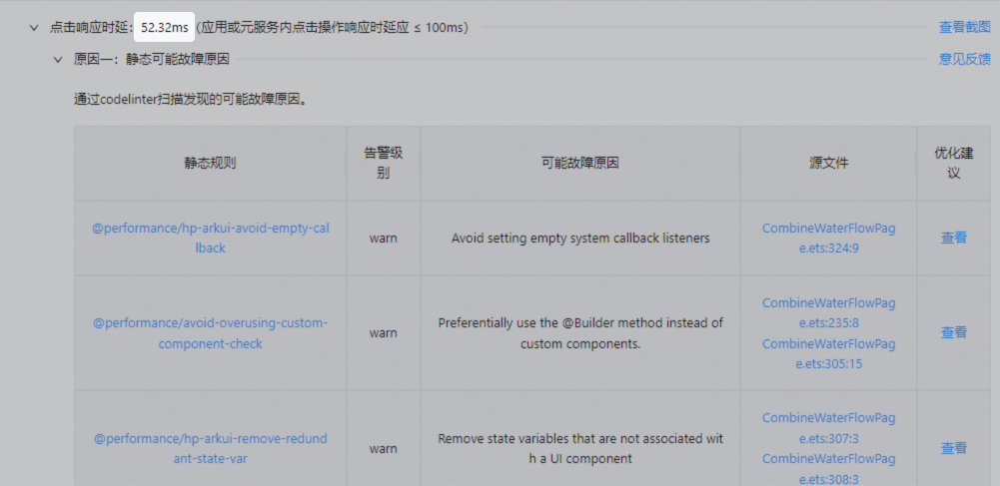
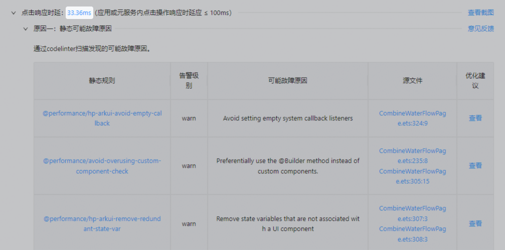

# 指标检测值无法点击拉起profiler

更新时间：2026-04-08 07:28:01

来源：https://developer.huawei.com/consumer/cn/doc/harmonyos-faqs/faqs-profiler-17

**问题现象**
 
报告详情页，指标检测值无法点击，如下图：
 

 

 
预期是可以点击指标检测值并拉起profiler，如下图：
 

 

 
**问题原因**
 
体检卡片勾选冷启动场景，但在录制开始时未重启应用，导致堆栈抓取失败。
 

 
**解决措施**
 
1、建议冷启动场景，使用“手动性能冷启动体检”卡片进行检测。
 
2、如果是自定义卡片场景勾选“冷启动”场景，需要在录制开始时，强制重启应用，之后再进行体检。
