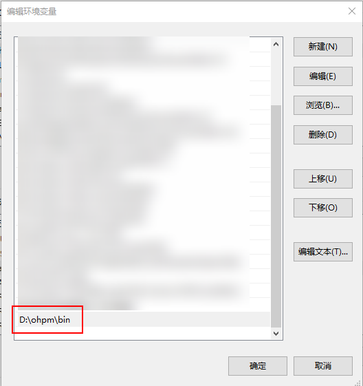
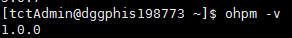

# 如何在命令行使用ohpm

更新时间：2026-03-10 06:16:35

来源：https://developer.huawei.com/consumer/cn/doc/harmonyos-faqs/faqs-development-environment-9


安装node.js 18.x及以上版本，并配置环境变量。

ohpm 默认解压路径为：DevEco Studio 中默认安装位置：<DevEco Studio 安装目录>\tools\ohpm；命令行工具中默认安装位置：<Command Line Tools 安装目录>/command-line-tools/ohpm。


问题现象1

安装ohpm后，如果在命令行中无法直接使用ohpm，请检查环境变量配置是否正确。

解决措施1

1. 在Windows系统中，右键点击“此电脑”选择“属性”，进入“高级系统设置”，点击“环境变量”，在“系统变量”中找到“Path”，点击“编辑”，添加ohpm工具包解压后的bin目录。

2. 添加变量后，重开命令行窗口，执行ohpm -v查看ohpm版本号，终端输出版本号信息（如1.0.0）即为成功。


问题现象2

在Linux/Mac系统中，安装ohpm后，不能在命令行中使用ohpm。

解决措施2

编辑配置文件，将ohpm工具包解压目录中的bin目录路径添加到PATH环境变量中（以 Mac 系统的 Zsh 命令行为例）。

1. 打开终端并编辑 ~/.zshrc 文件。
```bash
vi ~/.zshrc
```
2. 在文件末尾添加以下行，将软件的bin目录添加到PATH环境变量中（例如：/home/tctAdmin/ohpm/bin）：
```bash
export PATH="/home/tctAdmin/ohpm/bin:$PATH"
```
3. 保存 ~/.zshrc 文件并退出编辑器。
4. 使用以下命令使更改生效，或者关闭并重新打开命令行窗口。
```bash
source ~/.zshrc
```
5. 执行ohpm -v查看 ohpm 版本号，命令行输出版本号（如 1.0.0）表示成功。
```bash
ohpm -v
```


