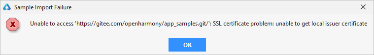

# 导入Sample时，提示SSL证书校验错误

更新时间：2026-03-10 06:16:35

来源：https://developer.huawei.com/consumer/cn/doc/harmonyos-faqs/faqs-development-environment-3

**问题现象**
 
导入Sample时，导入失败，提示“SSL certificate problem: unable to get local issuer certificate”证书校验错误。
 



 
**解决措施**
 
出现这个错误可能是网络遭受了攻击，或者你的网络提供方网络策略阻止了相关操作，如果你确认所处的网络环境安全，可以临时关闭证书校验以获取Sample。
 1. 进入Git安装目录（默认为C:\Program Files\Git），双击运行“git-cmd.exe”文件。
2. 在打开的命令行窗口中，执行如下命令关闭SSL证书校验功能。

  
> [!NOTE]
> 关闭SSL证书校验，可能会带来安全风险，建议导入完Sample后，及时开启。开启方法：将该命令中的false修改为true即可。


  
```bash
git config --global http.sslVerify false
```

3. 执行完成后，请重新尝试导入Sample。
