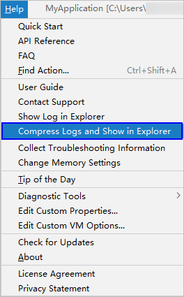
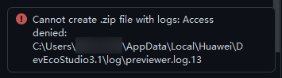

# 预览功能使用过程中，可能无法使用帮助菜单压缩日志按钮收集日志

更新时间：2026-03-10 06:16:35

来源：https://developer.huawei.com/consumer/cn/doc/harmonyos-faqs/faqs-previewer-operating-2

**问题现象**
 
当同时预览多个工程时，点击帮助菜单中的“压缩日志”按钮，可能会因日志文件被占用而无法压缩。
 

 
此时右下角会出现压缩失败的提示：
 

 
**解决措施**
 
请关闭预览过的工程，或者重启DevEco Studio后不要打开预览器，即可再次压缩收集日志。
