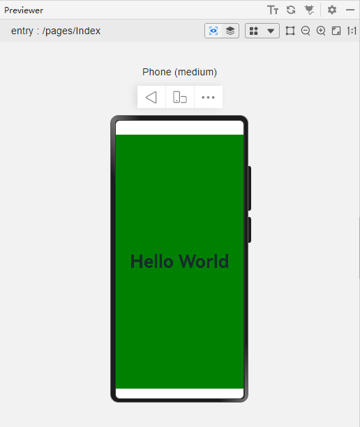

# 预览窗口顶部和底部出现白边

更新时间：2026-03-10 06:16:35

来源：https://developer.huawei.com/consumer/cn/doc/harmonyos-faqs/faqs-previewer-operating-6

**问题现象**
 
预览窗口顶部和底部出现白边。
 



 
**解决措施**
 
这是应用了沉浸式的特性，在沉浸式布局中，状态栏和导航条区域称为避让区，其余区域称为安全区。在默认情况下，开发者的组件被布局在安全区内。如果开发者希望将页面布局应用到全屏窗口，可以采用如下两种方式：
 
- 方法一：预览场景下，使用[expandSafeArea()](https://developer.huawei.com/consumer/cn/doc/harmonyos-references/ts-universal-attributes-expand-safe-area#expandsafearea)扩展安全区域属性。
```ArkTS
//Index.ets
@Entry
@Component
struct Index {
  @State message: string = 'Hello World';


  build() {
    RelativeContainer() {
      Text(this.message)
        .id('HelloWorld')
        .fontSize(50)
        .fontWeight(FontWeight.Bold)
        .alignRules({
          center: { anchor: '__container__', align: VerticalAlign.Center },
          middle: { anchor: '__container__', align: HorizontalAlign.Center }
        })
    }
    .height('100%')
    .width('100%')
    .backgroundColor('#008000')
    .expandSafeArea([SafeAreaType.SYSTEM])
  }
}
```


 
- 方法二：预览调试时，调用[setWindowLayoutFullScreen()](https://developer.huawei.com/consumer/cn/doc/harmonyos-references/arkts-apis-window-window#setwindowlayoutfullscreen9)接口设置窗口全屏。
```ArkTS
// EntryAbility.ets
onWindowStageCreate(windowStage: window.WindowStage): void {
  // Main window is created, set main page for this ability
  hilog.info(0x0000, 'testTag', '%{public}s', 'Ability onWindowStageCreate');
  windowStage.loadContent('pages/Index', (err) => {
    // ...
  });
  windowStage.getMainWindow((err, data) => {
    if (!err.code) {
      data.setWindowLayoutFullScreen(true)
    }
  });
}
```


 

 
**参考链接**
 
[开发应用沉浸式效果](https://developer.huawei.com/consumer/cn/doc/harmonyos-guides/arkts-develop-apply-immersive-effects)
