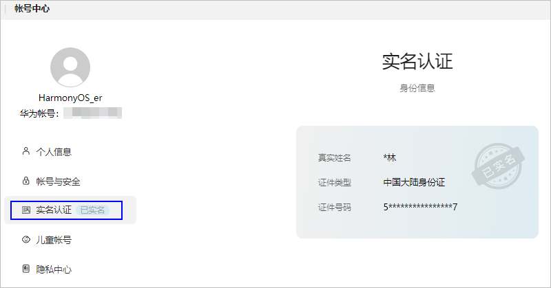
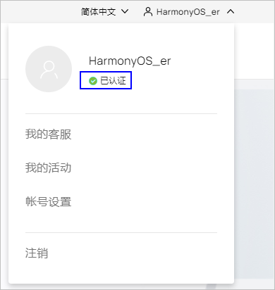

# 已实名认证，登录时还是提示用户需要进行实名认证

更新时间：2026-03-10 06:16:35

来源：https://developer.huawei.com/consumer/cn/doc/harmonyos-faqs/faqs-signature-service-2

问题现象

登录授权模拟器时，若提示华为账号需要实名制认证，请在账号中心检查账号状态。若状态显示“已实名”，请核对相关信息。

解决措施

华为账号实名分两种，一个是账号实名认证，即上图展示的状态，还有一个是开发者实名认证。这两种实名认证方式是不一样的，模拟器的登录授权是需要开发者实名认证，请根据实名认证指导进行处理。开发者实名认证后的结果如下图所示。

