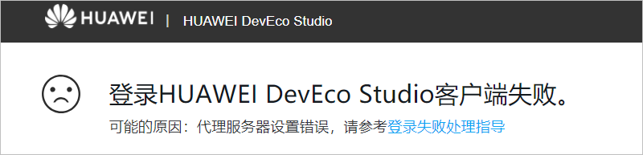
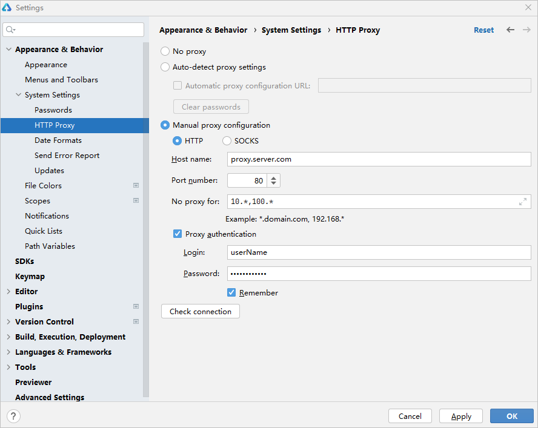
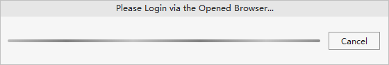

# 浏览器点击“允许”按钮后，出现登录客户端失败提示

更新时间：2026-03-10 06:16:35

来源：https://developer.huawei.com/consumer/cn/doc/harmonyos-faqs/faqs-signature-service-4

**问题现象**
 
使用实名认证的华为账号登录后，点击“允许”按钮进行授权。如果浏览器提示“登录HUAWEI DevEco Studio客户端失败”，请检查网络连接或重新尝试登录。
 

 
**解决措施**
 
该问题由DevEco Studio的HTTP代理问题引起。
 

 1. 检查HTTP Proxy设置。

  
如果网络无需代理即可访问Internet，设置代理会影响模拟器的登录授权。请检查并确保HTTP Proxy设置为“No proxy”。
2. 如果您的网络需要代理访问Internet，未设置代理会影响模拟器的登录授权，请检查并将HTTP Proxy设置为“Manual proxy configuration”，设置方法可参考[配置Proxy代理](https://developer.huawei.com/consumer/cn/doc/harmonyos-guides/ide-environment-config#section10369436568)。
3. 在DevEco Studio界面，点击**Cancel**按钮，重新登录授权。

  

