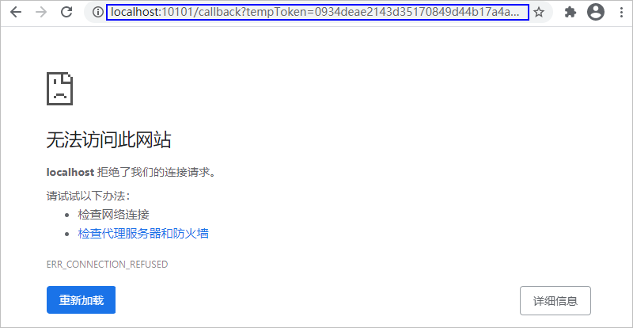

# 点击“允许”后，浏览器提示“无法访问此网站”

更新时间：2026-03-10 06:16:35

来源：https://developer.huawei.com/consumer/cn/doc/harmonyos-faqs/faqs-signature-service-5

**问题现象**
 
使用浏览器登录华为账号并点击“允许”按钮后，浏览器将跳转至http://localhost:10101/xxx，显示“无法访问此网站”。
 

 
**解决措施**
 
出现该问题的原因是登录授权过程中，DevEco Studio与华为账号之间的登录通道异常。具体原因包括点击了DevEco Studio登录界面的**Cancel**按钮，或者DevEco Studio在登录过程中异常关闭。
 
请尝试重新登录；建议在登录过程中不要做其它操作，避免误操作。如果重新登录还是出现该界面，请根据[浏览器点击“允许”按钮后，出现登录客户端失败提示](https://developer.huawei.com/consumer/cn/doc/harmonyos-faqs/faqs-signature-service-4)解决措施，检查和设置DevEco Studio的HTTP Proxy后进行重试。
