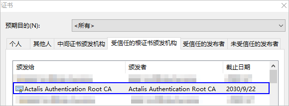
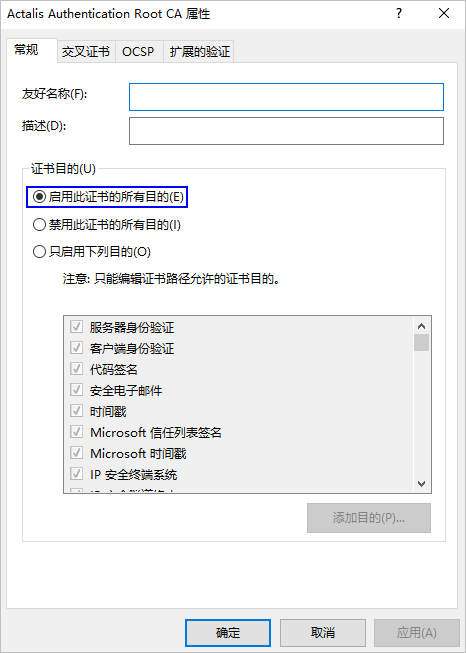

# 登录时浏览器提示不安全，“你的连接不是私密连接”

更新时间：2026-03-10 06:16:35

来源：https://developer.huawei.com/consumer/cn/doc/harmonyos-faqs/faqs-signature-service-6

问题现象

使用模拟器时，需通过浏览器登录授权。如果浏览器提示网站“不安全”或“连接不是私密连接”，请检查网络连接或联系技术支持。

解决措施

DevEco Studio云端服务平台使用的是ACTALIS颁发的商业证书。主流浏览器通常预置了ACTALIS公司的根证书。如果遇到上述问题，可以通过以下措施解决：

1. 检查是否已安装ACTALIS公司的根证书（不同浏览器的查看方法请自行查阅）。

- 已安装：检查Actalis证书是否被禁用。
- 未安装：请前往[https://www.actalis.it/area-download#](https://www.actalis.it/area-download)下载和安装“Actalis Authentication Root CA”，安装完成后重启浏览器即可。
2. 打开命令行工具，执行**certmgr.msc**命令，打开证书管理界面。
3. 在**受信任的根证书颁发机构 > 证书**中，找到 Actalis Authentication Root CA，右键点击并选择“属性”。
4. 选择“启用此证书的所有目的(E)”，点击**确定**，然后重启浏览器。

