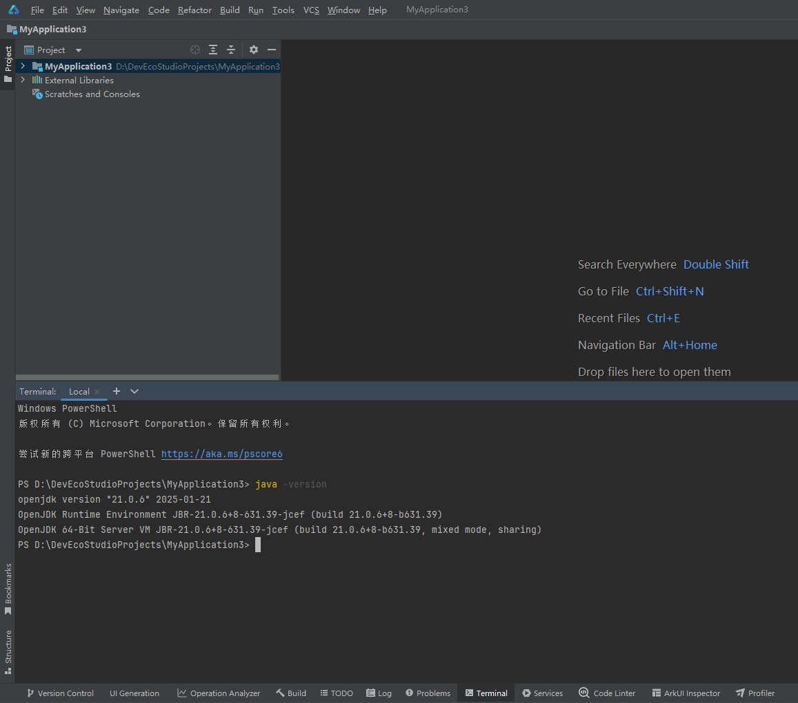
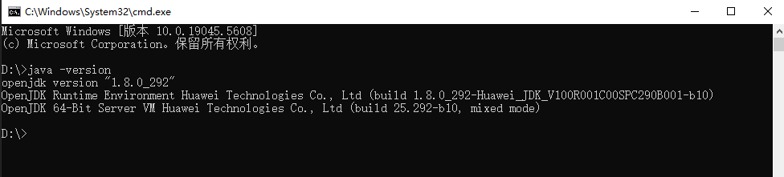

# 签名密钥库文件与JDK版本不兼容

更新时间：2026-03-10 06:16:35

来源：https://developer.huawei.com/consumer/cn/doc/harmonyos-faqs/faqs-signature-service-12

问题现象

打包签名提示“init keystore failed : parseAlgParameters failed:ObjectIdentifier()”错误。

可能原因

使用高版本JDK生成签名密钥库文件，使用低版本的JDK执行签名，因为兼容性问题无法解析签名密钥库文件，导致签名失败。

常见错误场景

1. DevEco Studio自动生成签名密钥库文件（*.p12），使用DevEco Studio预置的JDK，用户使用本地的低版本JDK进行签名，导致签名失败。
2. 用户使用本地高版本JDK生成签名密钥库文件（*.p12），使用DevEco Studio进行打包签名，DevEco Studio中预置的JDK版本低于用户的JDK，导致签名失败。

解决措施

请检查当前使用的JDK版本和生成签名证书文件使用的JDK版本，确保JDK版本一致，JDK版本信息查看方法如下：

1. 查看DevEco Studio预置的JDK版本信息，DevEco Studio Terminal窗口执行java -version命令，当前示例DevEco Studio预置的JDK版本为21.0.6。

2. 查看本地系统JDK版本信息，CMD窗口执行java -version命令，当前示例本地系统JDK版本为1.8.0_292，与步骤1示例中DevEco Studio预置的JDK版本不一致。

