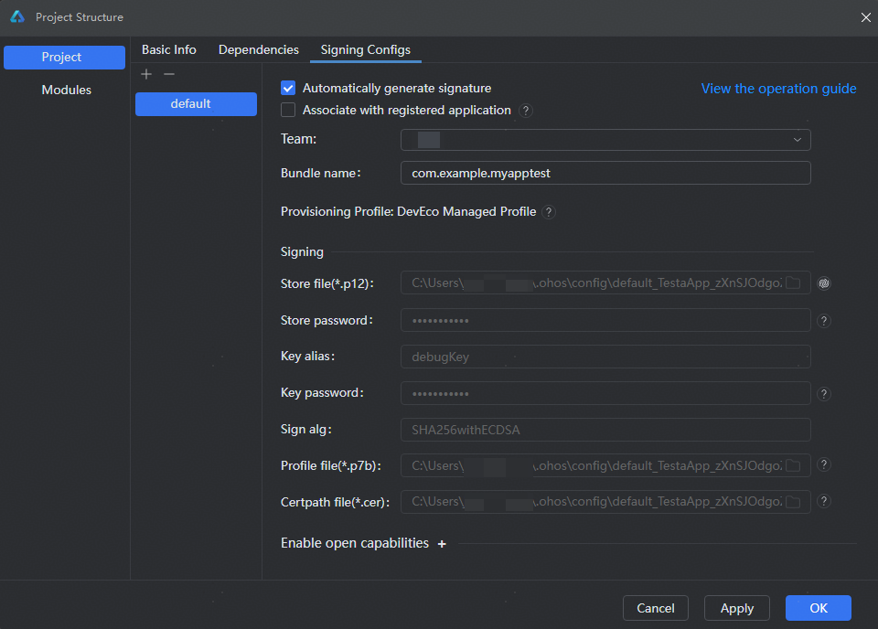
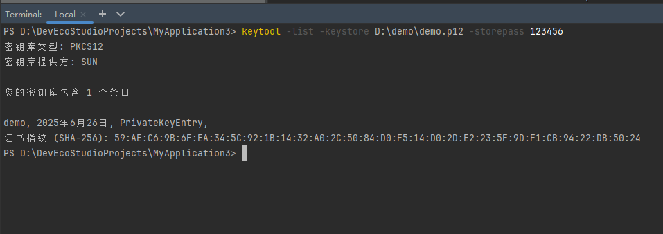
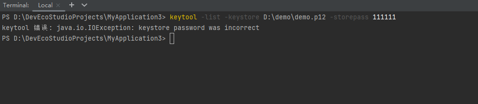

# 签名密钥库文件口令错误

更新时间：2026-03-10 06:16:35

来源：https://developer.huawei.com/consumer/cn/doc/harmonyos-faqs/faqs-signature-service-13

**问题现象**
 
打包签名提示“**Init keystore failed: keystore password was incorrect**”错误。
 
**可能原因**
 
签名密钥库文件口令错误。
 

 
**解决措施**
 
使用正确的密钥库文件口令，密钥库文件口令验证方式如下：
 
打开DevEco Studio Terminal窗口，使用keytool命令行工具验证密钥库文件口令，示例：keytool -list -keystore ${Store file} -storepass ${Store password}。
 
- 口令正确示例

 

 
- 口令错误示例

 

