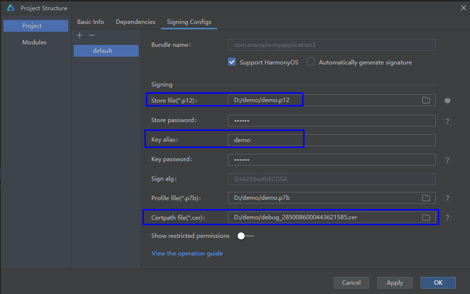
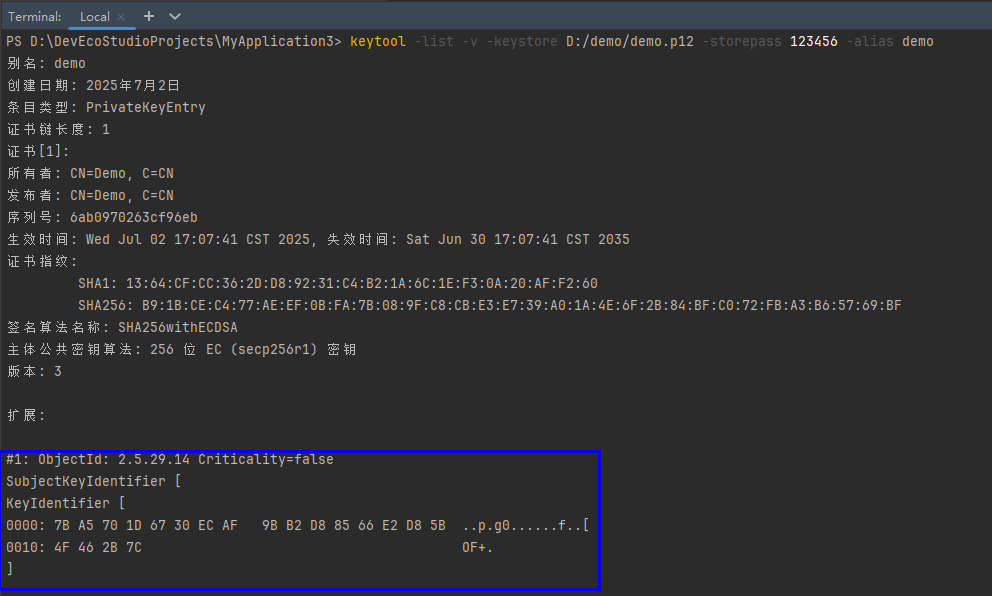
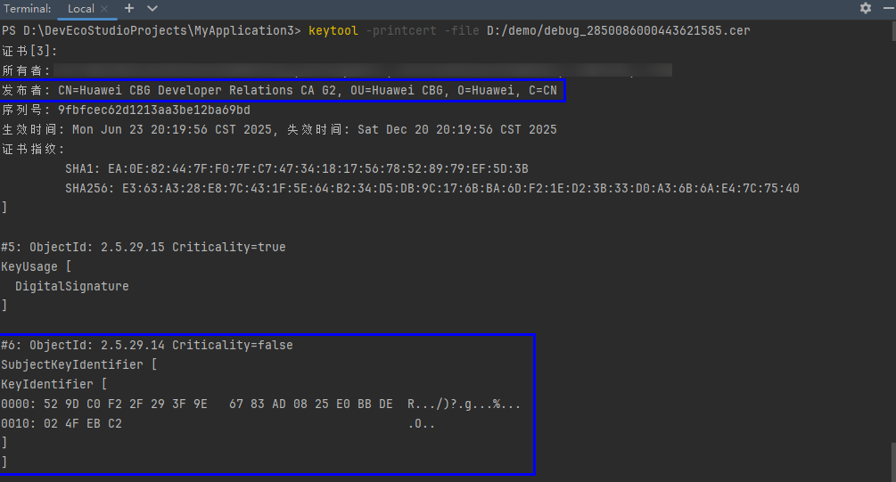

# 签名验签错误

更新时间：2026-03-10 06:16:35

来源：https://developer.huawei.com/consumer/cn/doc/harmonyos-faqs/faqs-signature-service-16

**问题现象**
 
打包签名提示“**Verify Signature failed**”错误。
 
**问题原因**
 
签名使用密钥库文件内的私钥与证书不匹配，导致工具验证签名失败。
 
**错误场景**
 
1、打包签名场景，签名时使用的证书和密钥不一致，证书文件中包含的公钥与签名密钥库文件内keyalias对应的私钥不匹配。
 
2、验证包完整性场景，已签名的HAP包被篡改。
 
**解决方案**
 
场景1：检查配置的证书文件和密钥库文件是否匹配，检查步骤如下：
 
1、查看签名配置。
 

 
2、查看密钥库文件签名密钥关联的证书公钥信息（SubjectKeyIdentifier），示例：keytool -list -v -keystore ${Store file} -storepass ${Store password} -alias ${Key alias}。
 

 

 
3、查看配置的证书文件中公钥信息，应用市场申请的证书，发布者是CN=Huawei CBG Developer Relations CA G2, OU=Huawei CBG, O=Huawei, C=CN，示例：keytool -printcert -file ${Certpath file}。
 

 
步骤2与步骤3中的公钥信息（SubjectKeyIdentifier）不一致，则配置的证书文件和密钥库文件不匹配。
 

 
场景2：重新打包签名。
 

