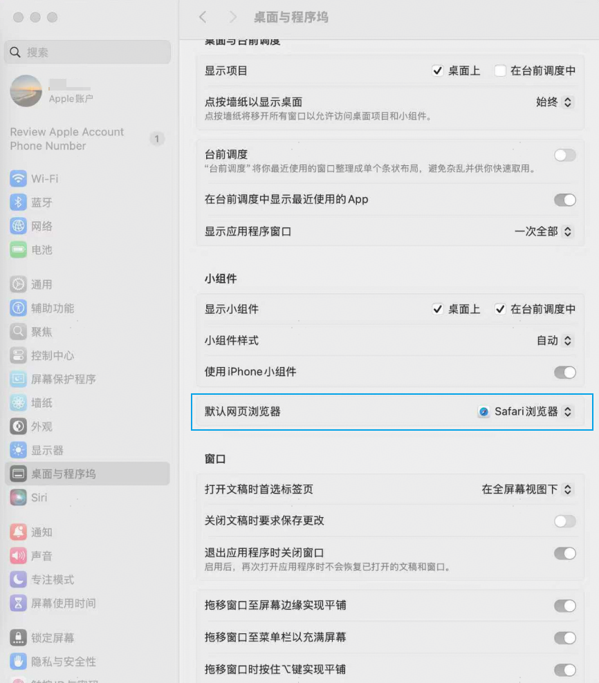
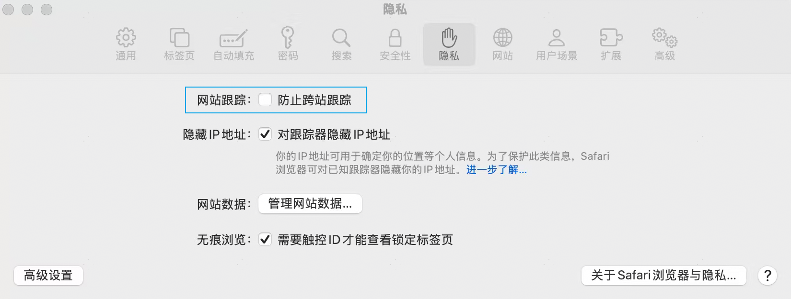
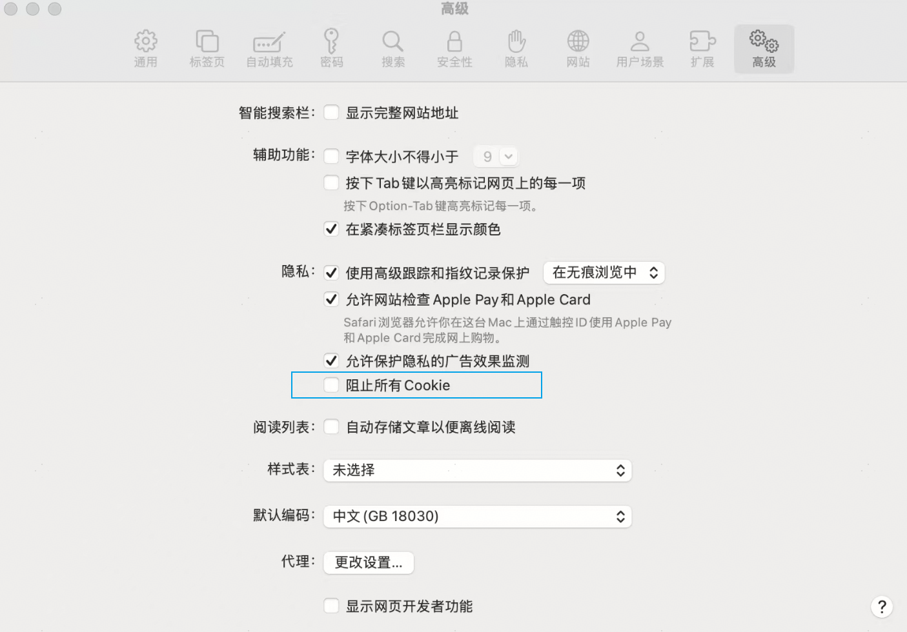

# 输入华为账号后，未出现“允许”按钮，浏览器界面无跳转

更新时间：2026-03-10 06:16:35

来源：https://developer.huawei.com/consumer/cn/doc/harmonyos-faqs/faqs-signature-service-3

**问题现象**
 
使用浏览器登录华为账号后，如果账号已实名认证但未出现授权的“允许”按钮，界面也未跳转或提示。
 
**解决措施**
 
该问题由浏览器兼容性问题导致。模拟器登录授权已在Chrome、IE11和Safari浏览器中进行了充分验证，建议将默认浏览器设置为其中一种。
 1. 设置或更改默认浏览器。

  
**Windows****平台**：以Windows 10为例，打开“**控制面板 > 程序 > 默认程序 > 设置默认程序**”，更改或设置默认浏览器。
2. **macOS平台**：以macOS 15为例，打开**系统设置，选择“桌面与程序坞”，再选择“默认网页浏览器****”**，更改或设置默认浏览器。

  使用Safari浏览器时，点击**Safari 浏览器 > 偏好设置>****隐私/高级**，取消“防止跨站跟踪”和“阻止所有Cookie”设置。

  

  

3. 在DevEco Studio界面，点击**Cancel**按钮，然后重新登录授权。

  

