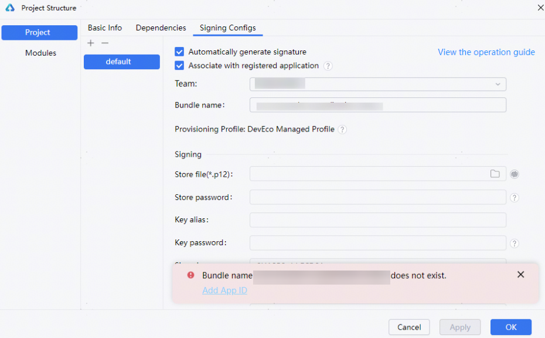
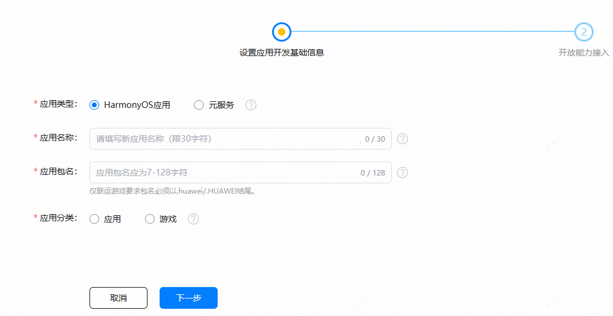
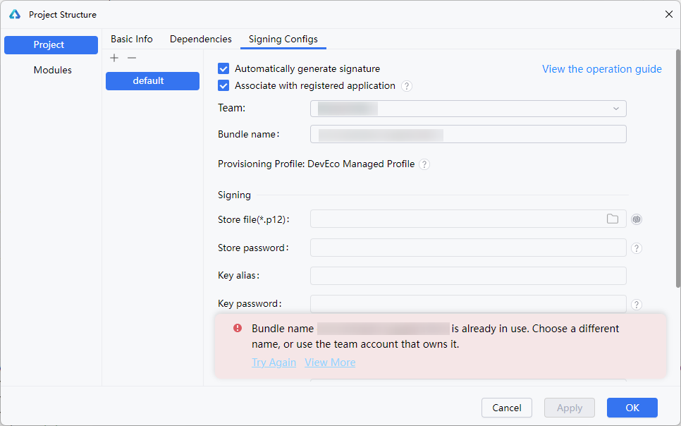
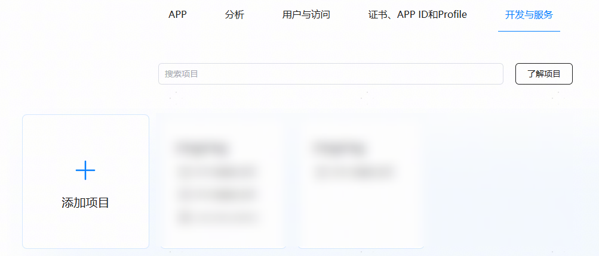

# 配置调试签名异常

更新时间：2026-03-10 06:16:35

来源：https://developer.huawei.com/consumer/cn/doc/harmonyos-faqs/faqs-signature-service-18

#### 提示"Bundle name *** does not exist."

**报错原因**
 
上传的应用/元服务在AGC中不存在，导致校验失败。
 
**解决措施**
 
方式一：
 1. 点击报错信息弹窗中“**Add App ID**"，在DevEco Studio界面添加应用/元服务的基本信息，点击**OK**。

  
**Project**：项目名称。可以输入一个新项目名称，或在下拉框中选择已有项目。
2. **App type**：应用类型为HarmonyOS应用/元服务。
3. **App name**：华为应用市场详情页展示的名称。
4. **App package name**：应用包名。App type为HarmonyOS应用时，才需要填写该字段。字段内容跟工程的Bundle name一致，不支持修改。
5. **App category**：应用分类。
6. 应用/元服务添加完成后，再进行签名。
 

 
方式二：
 1. 进入AGC创建应用/元服务，创建时包名和DevEco Studio创建应用时的Bundle name一致。创建过程具体可参考[操作步骤](https://developer.huawei.com/consumer/cn/doc/app/agc-help-create-app-0000002247955506#section1772711713288)、[创建元服务](https://developer.huawei.com/consumer/cn/doc/app/agc-help-create-atomic-service-0000002247795706)。

  

2. 创建完成后，返回DevEco Studio界面重新签名。
 
 

#### 提示"Bundle name *** is already in use. Choose a different name, or use the team account that owns it."

**报错原因**
 
场景一：在应用市场中应用名称具有唯一性，应用名称（包名）不可重复。包名被其它应用使用。
 
场景二：应用名称被其它团队使用，开发者不在该团队。
 
**解决措施**
 
方式一：修改包名。根据提示信息添加应用，再进行签名。
 
方式二：
 1. 加入目标团队，具体可参考[添加成员账号](https://developer.huawei.com/consumer/cn/doc/app/agc-help-manageaccount-0000002306610129#section151241455193313)。
2. 加入团队成功后，将**Team**修改为目标团队。

  

 
 

#### 提示"Failed to find the capabilities.Check the following configurations: Networkconnection,HTTP Proxy,etc."

**报错原因****和解决措施**
 
场景一：网络连通问题，请先检查和配置网络，再进行签名。配置网络具体请参考[配置Proxy代理](https://developer.huawei.com/consumer/cn/doc/harmonyos-guides/ide-environment-config#section10369436568)。
 
场景二：应用没有开放能力管理和ACL权限设置项，需要重新创建应用，再进行签名。查看设置项和创建应用的操作如下：
 1. 进入[AGC](https://developer.huawei.com/consumer/cn/service/josp/agc/index.html#/)，点击**开发与服务**，选择应用所在的项目。

  

2. 选择应用，查看应用的开放能力管理和ACL权限设置项。若两个设置项不存在，需重新创建HarmonyOS应用和添加APP ID，具体请参考为HarmonyOS应用创建APP ID。
 
**参考链接**
 
[操作步骤](https://developer.huawei.com/consumer/cn/doc/app/agc-help-create-app-0000002247955506#section1772711713288)
 
 

#### 提示"Failed to verify the bundle name. Check your network connection or try again after configuring a proxy."

**报错原因****和解决措施**
 
场景一：网络连通问题，请先检查和配置网络，再进行签名。配置网络具体请参考[配置Proxy代理](https://developer.huawei.com/consumer/cn/doc/harmonyos-guides/ide-environment-config#section10369436568)。
 
场景二：在DevEco Studio退出登录，重新登录，再进行签名。
