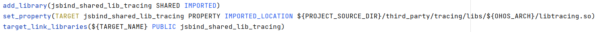

# C/C++项目三方依赖库未打包到HAP

更新时间：2026-03-10 06:16:35

来源：https://developer.huawei.com/consumer/cn/doc/harmonyos-faqs/faqs-compiling-and-building-22

问题现象

C/C++项目依赖三方so时，在打包生成HAP后，发现三方so未打包到HAP中。

解决措施

当前DevEco Studio对C/C++项目中第三方so文件的寻址方式存在限制。如果第三方so文件未打包到HAP中，请尝试修改so文件的引入方式。

1. 定义一个别名，例如jsbind_shared_lib_tracing，代表将要引入的三方so。
2. 使用SHARED IMPORT将三方so动态引入。
3. 使用IMPORTED_LOCATION定义引入的so文件位置。
4. 将定义的三方so声明给目标。

5. 再次打包生成HAP，确认三方so已打包到HAP中。
