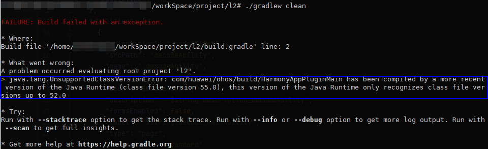

# JDK版本不匹配导致编译失败

更新时间：2026-03-10 06:16:35

来源：https://developer.huawei.com/consumer/cn/doc/harmonyos-faqs/faqs-compiling-and-building-14

**问题现象**
 
通过命令行方式构建HarmonyOS应用或元服务过程中出现构建失败，现象如下图所示。
 

 
**解决措施**
 
该问题需使用配套的JDK 17版本解决，请根据如下方法进行修正：
 1. 下载并安装JDK 17版本。
2. 修改JAVA_HOME环境变量，取值为JDK 17。如果是Linux系统，可参考命令行方式构建服务或应用的[配置JDK](https://developer.huawei.com/consumer/cn/doc/harmonyos-guides/ide-command-line-building-app#section195447475220)。
