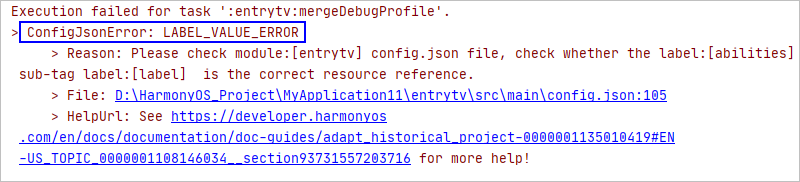
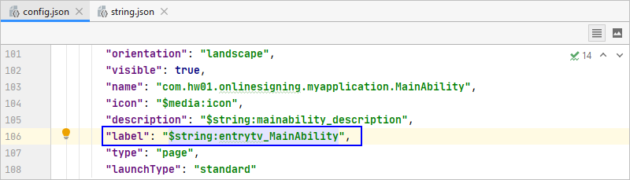

# LABEL_VALUE_ERROR处理指导

更新时间：2026-03-10 06:16:35

来源：https://developer.huawei.com/consumer/cn/doc/harmonyos-faqs/faqs-compiling-and-building-15

**问题现象**
 
在工程同步、编译构建过程中，提示**LABEL_VALUE_ERROR**错误信息。
 

 
**解决措施**
 
该问题由config.json文件的资源引用规则变更引起，需将“label”字段的取值修改为资源引用方式。
 1. 在**resources > base > element**中的string.json中添加对应的字符串信息。
2. 在config.json中重新引用该字符串资源。

  

