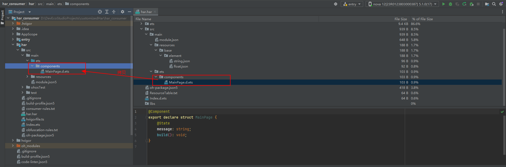
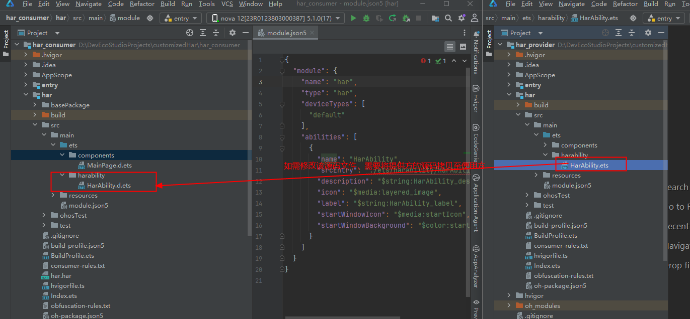
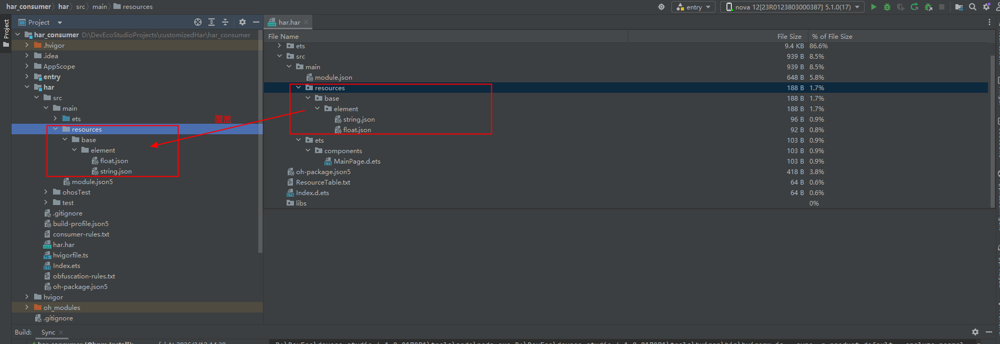
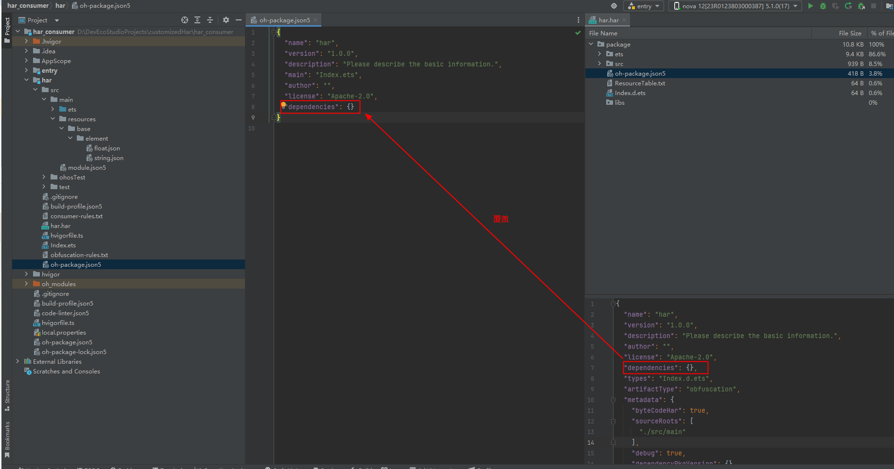
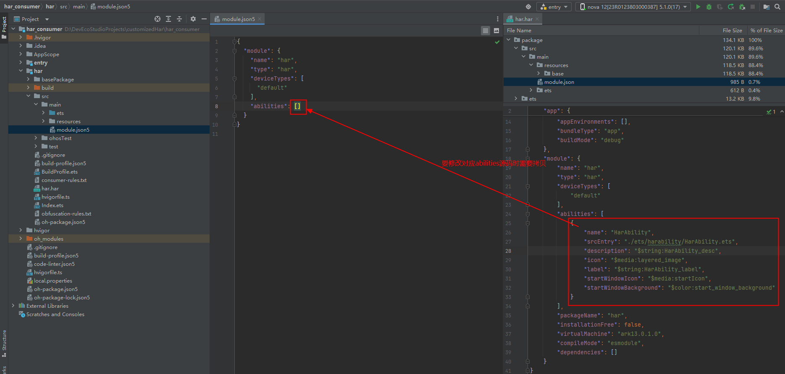
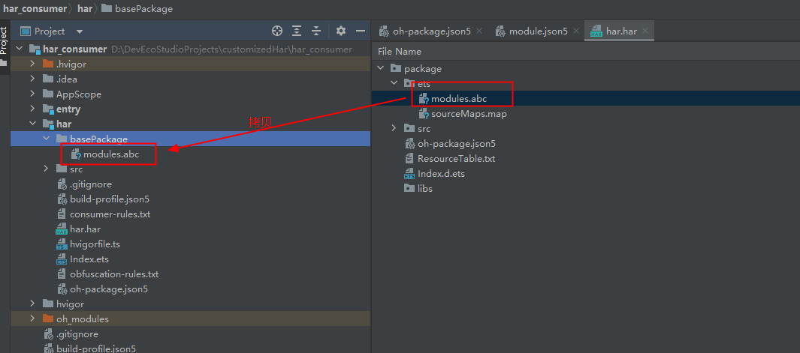

# 三方SDK定制修改部分源码

更新时间：2026-04-08 07:28:01

来源：https://developer.huawei.com/consumer/cn/doc/harmonyos-faqs/faqs-compiling-and-building-192

问题背景

SDK使用方需在SDK上定制功能开发，SDK提供方仅希望提供SDK和部分源码文件。SDK使用方修改其中部分源码文件，并在编译时替换掉修改部分。

解决措施

从DevEco Studio 6.0.2 Beta1版本开始，提供替换abc中的部分文件能力，支持定制化文件的编译以及替换三方SDK中编译后的同名文件。

使用能力方式如下：

SDK提供方：

提供SDK（即字节码HAR包），并提供待修改部分的源码文件。

SDK使用方：

新增"Static Library"模块A，要求模块A与提供方的SDK同packageName(oh-package.json5的name字段)和moduleName(module.json5的name字段)，并将模板A中的MainPage.ets源码文件删除。如下所示，拷贝提供方SDK中所有的声明文件、需要修改的源码文件、abc文件、和资源相关文件到模块A中。
1. 源码：声明文件：将src/main/ets目录拷贝到模块A中，保持原目录结构不变。

2. 需要修改的源码：按照提供方SDK中的目录层级增加需要修改的源码文件，保持和提供方目录结构一致。


 资源文件：
使用提供方SDK中的resources目录覆盖模块A中的resources目录。




 配置文件：
1. 将提供方SDK的依赖配置（模块A的oh-package.json5中的dependencies字段）拷贝到模块A中的依赖配置中。

2. 如果需要修改ability的srcEntry文件，就需要将提供方SDK中module.json对应的ability字段拷贝至模块A的module.json5的abilities中，再对ability的srcEntry文件进行修改


 abc文件：
将提供方产物中的modules.abc文件拷贝至模块A目录下，并在模块级build-profile.json5文件，buildOption->packingOptions字段中新增customizedOptions，增加basePackage字段指定abc的位置。




```json
"buildOption": {
"packingOptions": {
"customizedOptions": {
"basePackage": "./basePackage/modules.abc" //相对路径
}
}
},
```


 修改代码后，选择Build菜单的Make Module 'xxx'选项，编译该模块。

约束(SDK使用方)：

1. hvigor-config.json5文件的properties下不能将ohos.compile.lib.entryfile配置为false。
2. 从提供方拷贝过来的文件名、资源名、方法名：支持新增，不支持修改、删除。
3. 如果工程中存在其他模块引用了提供方SDK，则需要在工程级别oh-package.json5文件中配置[overrides选项](https://developer.huawei.com/consumer/cn/doc/harmonyos-guides/ide-oh-package-json5#zh-cn_topic_0000001792256137_overrides)，改成本地依赖方式。
4. 不允许额外修改模块A配置文件（包括oh-package.json5，module.json5）。
5. 不支持C++源码的修改替换。
6. 仅支持Har的源码修改，不支持Hap和Hsp的源码修改替换。
7. 模块A的混淆规则需要继承提供方SDK中的混淆规则。（建议提供方SDK关闭混淆，如开启需要参考以下a、b进行额外操作）需要将MainPage加入到混淆白名单，需要将需要修改的文件名配置白名单。
8. 中间自动生成的文件moduleInfo.ts及其父目录均需要添加至白名单。

 使用该功能后，会遍历源码目录，将.d.ets和.d.ts文件打包到har产物中，请保证不要将重要信息存放在.d.ets及.d.ts文件中。
