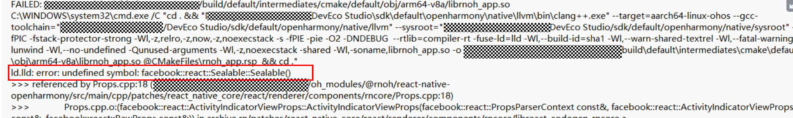

# 升级react-native-openharmony编译出错

更新时间：2026-03-10 06:16:35

来源：https://developer.huawei.com/consumer/cn/doc/harmonyos-faqs/faqs-compiling-and-building-185

**问题现象**
 
升级react-native-openharmony编译出错，类似如下报错：
 

 
**问题原因**
 
旧版本的react-native-openharmony缓存还在,导致某些链接找不到。
 
**解决措施**
 
删除要编译的模块根目录下的.cxx和build目录,然后重新触发编译。
