# 如何使用手动生成证书打包

更新时间：2026-03-10 06:16:35

来源：https://developer.huawei.com/consumer/cn/doc/harmonyos-faqs/faqs-compiling-and-building-54

操作步骤：

1. 生成密钥和证书请求文件。在申请数字证书和Profile文件前，需使用DevEco Studio生成密钥和证书请求文件。
- 密钥包含非对称加密中使用的公钥和私钥，存储在格式为.p12的密钥库文件中，用于数字签名和验证。
- 证书请求文件格式为.csr，包含密钥对中的公钥和公共名称、组织名称、组织单位等信息，用于向AGC申请数字证书。

 选择“Build > Generate Key and CSR”。
2. 点击“Choose Existing”，选择已有的密钥库文件（.p12文件），然后跳转至步骤d继续配置。如果没有密钥库文件，点击“New”，跳转至步骤c进行创建。
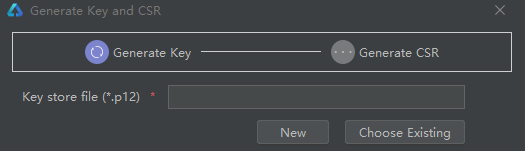
3. 在“Create Key Store”界面，填写密钥库信息后，点击“OK”。
- Key store file：设置密钥库文件存储路径，填写p12文件名。
- Password：设置密钥库密码。密码必须由大写字母、小写字母、数字和特殊符号中的两种以上字符组合，长度至少为8位。请记住该密码，后续签名配置时需要使用。
- Confirm password：输入密钥库密码。

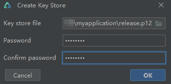
4. 在“Generate Key and CSR”界面继续填写密钥信息后，点击“Next”。
- Alias：密钥的别名，用于标识密钥。记住该别名，后续签名配置时需要使用。
- Password：密钥对应的密码。
- Validity：证书有效期，建议设置为25年。
- Certificate：输入证书基本信息。

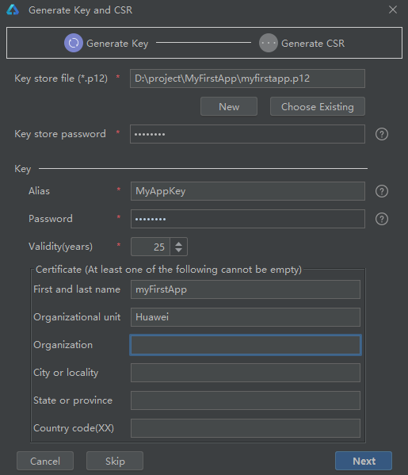
5. 在“Generate Key and CSR”界面设置CSR文件存储路径和文件名，然后点击“Finish”。
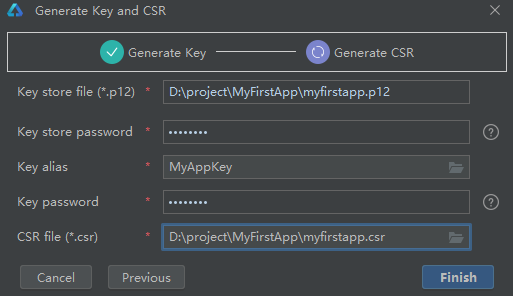
 CSR文件创建成功后，将在存储路径下生成密钥库文件（.p12）和证书请求文件（.csr）。
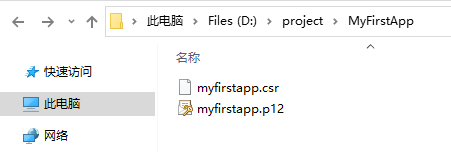

 申请调试证书，用于配置HarmonyOS应用/元服务的签名信息，保障软件代码完整性和发布者身份真实性。证书格式为.cer，包含公钥和证书指纹。
1. 登录[AppGallery Connect](https://developer.huawei.com/consumer/cn/service/josp/agc/index.html#/)。选择“用户与访问”。
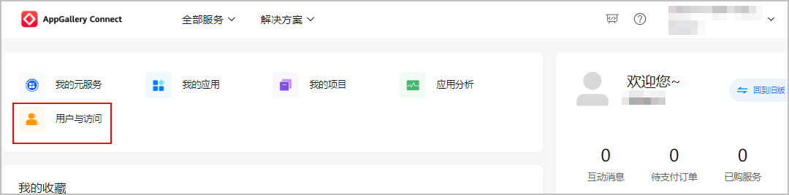
2. 选择“证书管理”，点击“新增证书”。
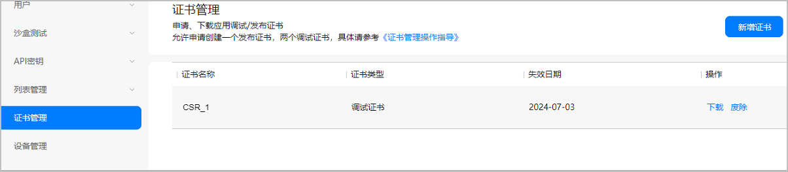
3. 填写要申请的证书信息，点击“提交”。
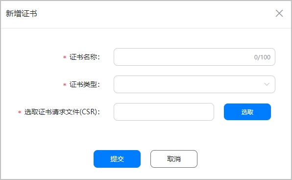
4. 证书申请成功后，展示证书名称、证书类型和失效日期。点击“下载”，保存证书至本地。
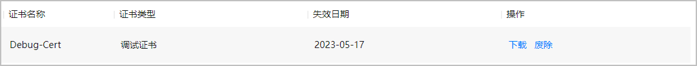

 注册调试设备。
1. 登录[AppGallery Connect](https://developer.huawei.com/consumer/cn/service/josp/agc/index.html#/)，选择“用户与访问”。
2. 选择“设备管理”，点击右上角的“添加设备”，填写设备信息，点击“提交”。
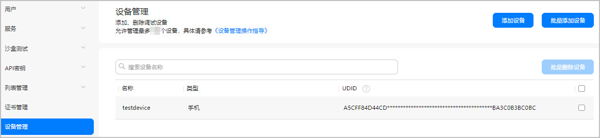
3. 设备添加成功后，您可以在“设备管理”页面查看设备的名称、类型和UDID。

4. 如需删除调试设备，勾选一个或多个设备，点击“批量删除设备”，在弹出窗口中点击“确认”。
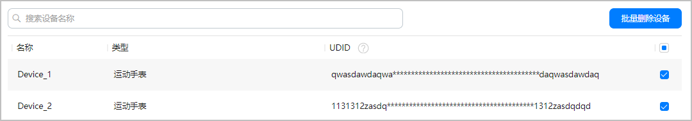

 申请调试Profile。
1. 登录[AppGallery Connect](https://developer.huawei.com/consumer/cn/service/josp/agc/index.html#/)，选择“我的项目”。
2. 找到项目，点击创建的HarmonyOS应用或元服务。
3. 选择“HarmonyOS应用 > HAP Provision Profile管理”，点击右上角“添加”。
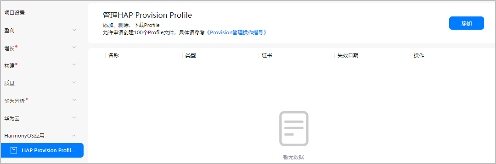
4. 在弹出的“HarmonyAppProvision信息”窗口中添加调试Profile，完成后点击“提交”。
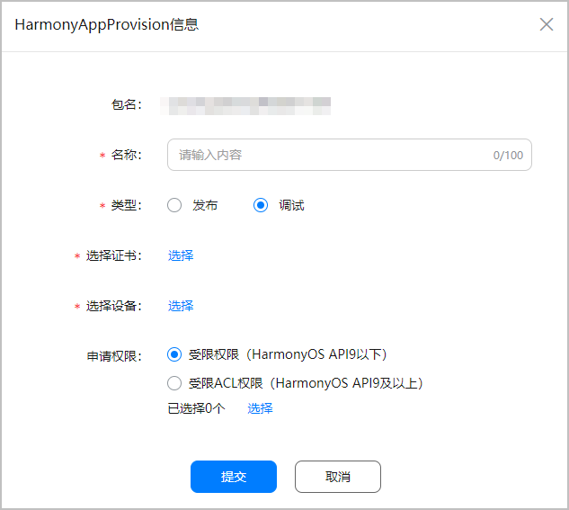
5. 调试Profile申请成功后，展示Profile信息。点击“下载”，保存Profile至本地。
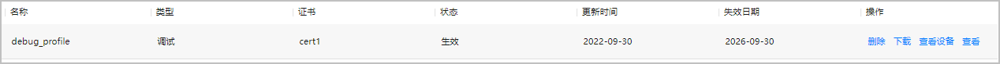

 手动配置签名信息。
1. 打开DevEco Studio，选择“File > Project Structure”，进入“Project Structure”界面。
2. 导航到“Project”，点击“Signing Configs”页签。取消勾选“Automatically generate signature”（如果是API 8和9工程，还需勾选“Support HarmonyOS”），填写相关信息，然后点击“OK”。
- Store File：选择生成的.p12文件。
- Store Password：密钥库密码，需与生成密钥和证书请求文件时设置的密码一致。
- Key alias：密钥别名，需与生成密钥和证书请求文件时设置的别名一致。
- Key password：设置的密钥密码，需与生成密钥和证书请求文件时的密码一致。
- Sign alg：设置为“SHA256withECDSA”。
- Profile file：选择.p7b文件。
- Certpath file：选择.cer文件。

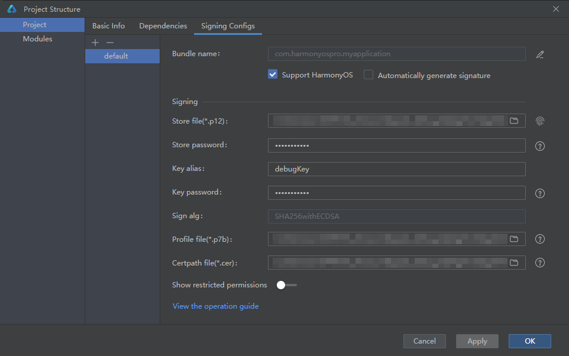

参考链接

手动签名
