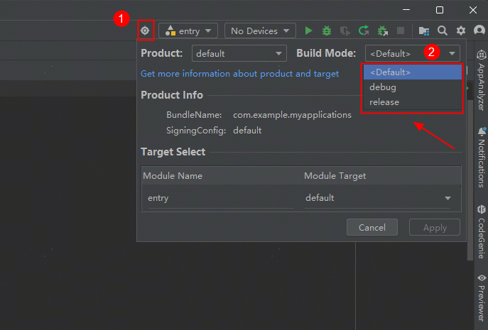

# 如何在不修改build-profile.json5的情况下选择构建debug或release版本

更新时间：2026-03-10 06:16:35

来源：https://developer.huawei.com/consumer/cn/doc/harmonyos-faqs/faqs-compiling-and-building-46

1. 通过“Build”窗口进行编译构建时，默认“Build Hap(s)”为debug模式，“Build App(s)”为release模式。用户也可以自主选择编译模式为debug或release。
2. 开发者可以在DevEco Studio中选择相应的编译模式。选择后，系统将按所选模式进行编译，所选模式的优先级高于默认模式。
 

