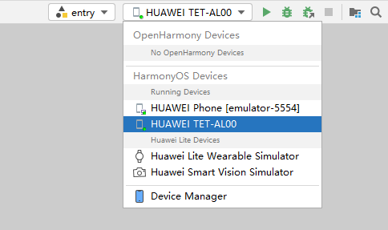
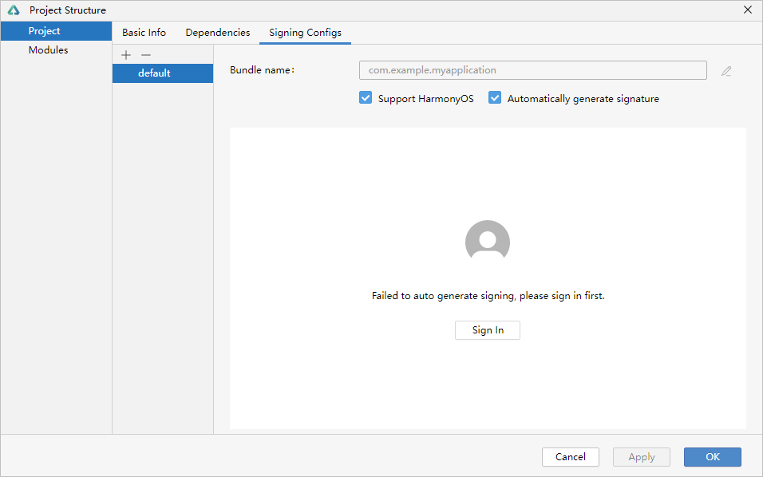
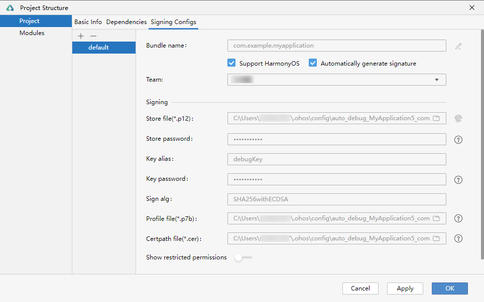

# 如何给新增的module在线签名

更新时间：2026-03-10 06:16:35

来源：https://developer.huawei.com/consumer/cn/doc/harmonyos-faqs/faqs-compiling-and-building-52

操作步骤：
 1. 连接真机设备，确保[DevEco Studio与真机设备已连接](https://developer.huawei.com/consumer/cn/doc/harmonyos-guides/ide-run-device)，真机连接成功后如下图所示：

2. 进入 File > Project Structure... > Project > Signing Configs 界面，勾选“Automatically generate signature”。如果是 HarmonyOS 工程，还需勾选“Support HarmonyOS”。若未登录，请先单击 Sign In 进行登录，然后完成签名。

  签名完成后，如下图所示：

  

