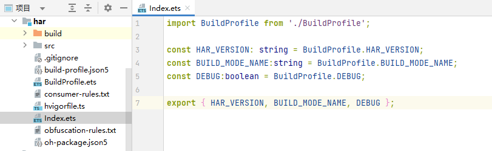

# 如何获取BuildProfile中的值

更新时间：2026-03-10 06:16:35

来源：https://developer.huawei.com/consumer/cn/doc/harmonyos-faqs/faqs-compiling-and-building-72

生成 BuildProfile 文件后，可以通过相对路径在代码中引入该文件。例如，在 HAR 模块的 Index.ets 文件中使用该文件：

```ts
import BuildProfile from './BuildProfile';
```

获取 BuildProfile 类中的值：

```ts
const HAR_VERSION: string = BuildProfile.HAR_VERSION;
const BUILD_MODE_NAME: string = BuildProfile.BUILD_MODE_NAME;
const DEBUG: boolean = BuildProfile.DEBUG;
```





参考链接

HAR运行时获取编译构建参数
