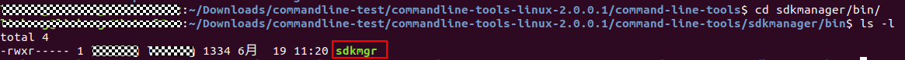
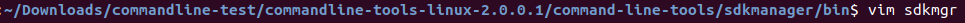

# 如何解决搭建流水线时commandline-tools-linux中sdkmgr下载开发包报错

更新时间：2026-03-10 06:16:35

来源：https://developer.huawei.com/consumer/cn/doc/harmonyos-faqs/faqs-compiling-and-building-76

**问**
 
使用 commandline-tools 工具在 Linux 上时，如果提示“Failed to request URL https://devecostudio-dre.op.hicloud.com/sdkmanager/v5/hos/getSdkList”，请检查网络连接是否正常，确保可以访问该 URL。如果网络无问题，尝试更新 commandline-tools到最新版本。
 

 
**解决措施**
 
该问题通常是因为Linux的国家码未设置为中国区所致。
 
请参考以下方法解决：
 1. 进入sdkmgr脚本所在的文件夹：${命令行工具根目录}/sdkmanager/bin。

2. 打开sdkmgr文件。

3. 在文件的最后一行，-Dfile.encoding=UTF-8 后面添加 -Duser.country=CN。

4. 保存修改，再次执行sdkmgr相关命令即可。
