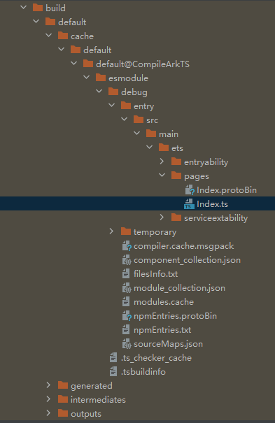

# 如何解决自定义组件struct内不支持定义成员变量get/set方法的问题

更新时间：2026-03-10 06:16:35

来源：https://developer.huawei.com/consumer/cn/doc/harmonyos-faqs/faqs-compiling-and-building-50

问题现象

运行DevEco Studio的build编译构建功能后，产物中不会生成get/set方法的代码逻辑。





错误示例如下：

```ts
@Entry
@Component
struct GetSetDemo {
private get value(): string {
return "Hello";
}
private set value(value: string) {
this.value = value;
}

build() {
Row() {
Column() {
Text("Hello World")
.fontSize(50)
.fontWeight(FontWeight.Bold)
}
}
}
}
```

解决措施

1.可以使用以下方法替代get方法：

private value: string = "Hello";

2.可以使用以下方式替代 set方法：

this.value = "World"；
