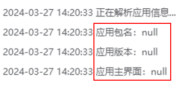
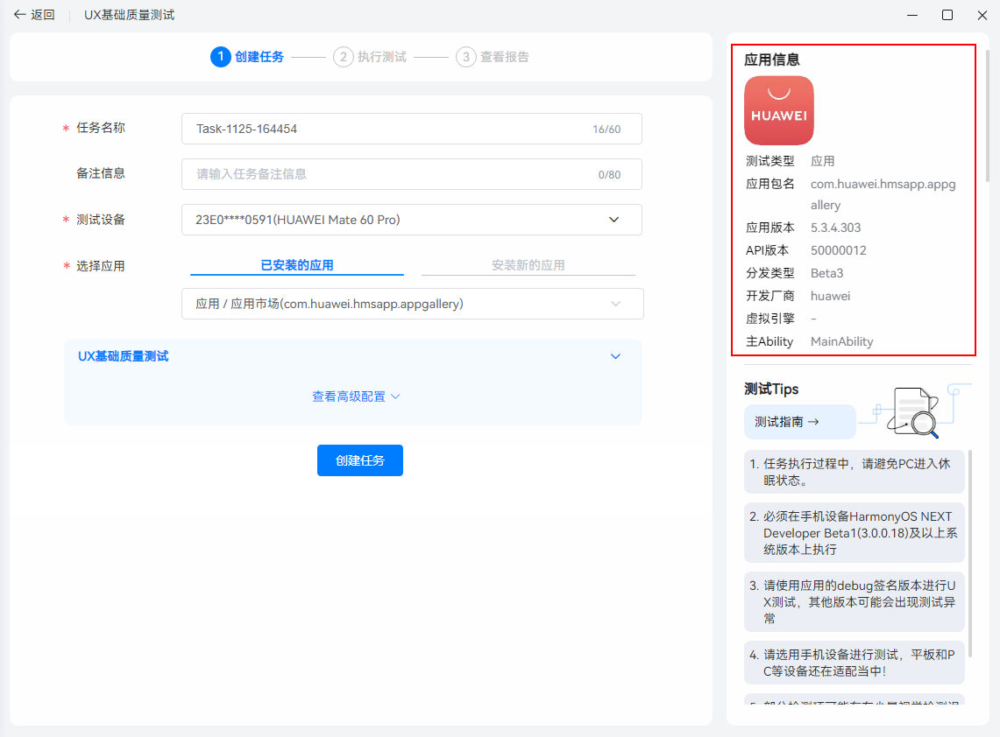

# 测试报告中，为什么会批量出现待检测项

更新时间：2026-03-10 06:16:35

来源：https://developer.huawei.com/consumer/cn/doc/harmonyos-faqs/faqs-publish-test-3

由于测试任务内部异常，偶现任务终止的情况。请查看【测试报告-执行日志】，如果应用信息为空，请重新创建任务并执行测试。
 

 
该问题由应用信息未完全解析导致。再次创建任务时，请等待右侧应用信息加载完成，再进行创建，即可解决该问题。
 

