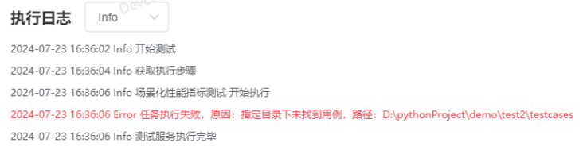

# 任务执行失败，原因：指定目录下未找到用例。该如何排查

更新时间：2026-03-10 06:16:35

来源：https://developer.huawei.com/consumer/cn/doc/harmonyos-faqs/faqs-scenario-based-performance-test-5

检查用例对应的JSON文件中的Python文件路径是否正确，该路径是testcases目录下的相对路径。
