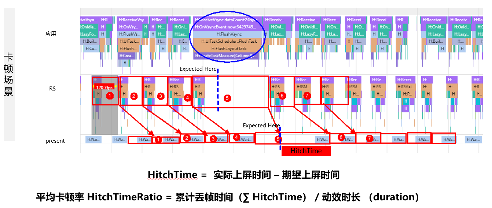

# 卡顿率指标是怎么定义的

更新时间：2026-03-10 06:16:35

来源：https://developer.huawei.com/consumer/cn/doc/harmonyos-faqs/faqs-scenario-based-performance-test-10

卡顿率是指在一段动效区间内累计的丢帧时长，用于评估整个动效时段的画面流畅度。卡顿率的值是累计丢帧时长与动效时长的比值，单位为ms/s。

单帧丢帧时长等于实际上屏时间减去期望上屏时间。上屏时间可在trace图形子系统的present线程中查看，取泳道结束点。

