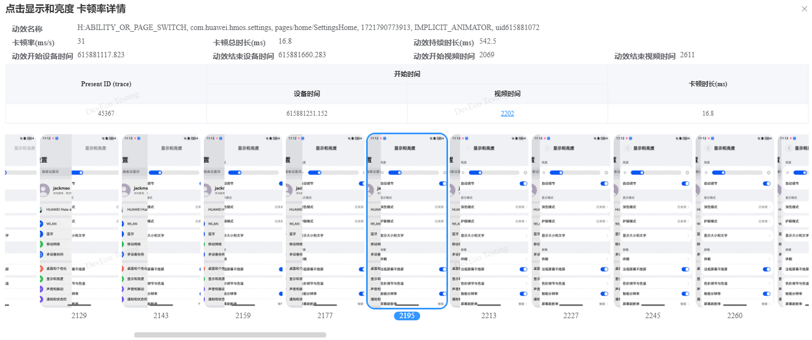

# 卡顿率显示的视频时间与下面给的视频图片集编号对不上，是什么原因

更新时间：2026-03-10 06:16:35

来源：https://developer.huawei.com/consumer/cn/doc/harmonyos-faqs/faqs-scenario-based-performance-test-8

 
卡顿率指标关注设备的时间性能，可以与trace中RenderService帧的上屏时间相对应。提供的帧图片集仅供参考。
