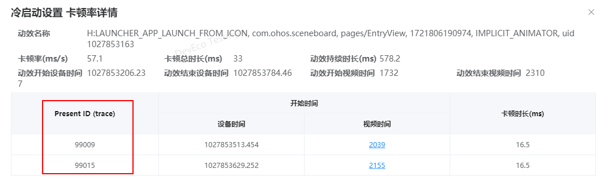
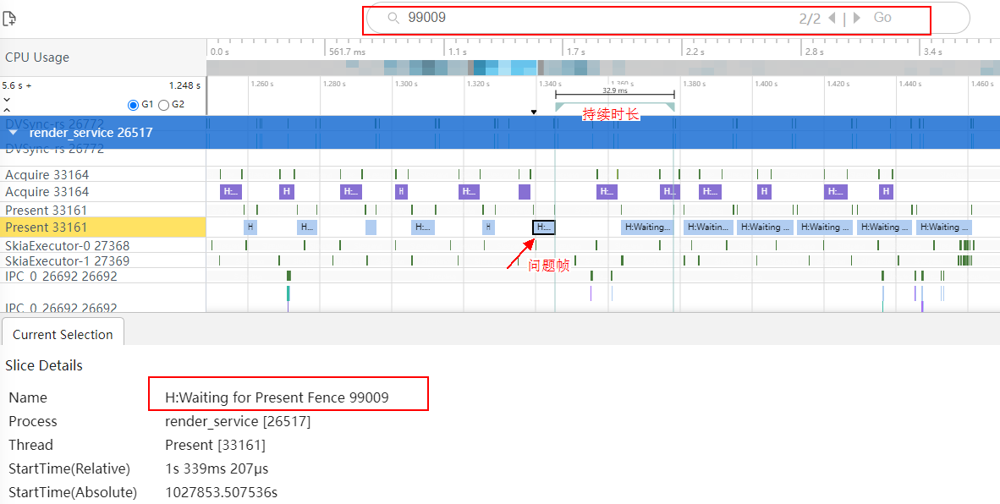

# 如何结合trace，分析卡顿率指标异常问题

更新时间：2026-03-10 06:16:35

来源：https://developer.huawei.com/consumer/cn/doc/harmonyos-faqs/faqs-scenario-based-performance-test-12

下载并打开trace后，通过上报的Present ID字段搜索，可快速定位问题点。
 

 

 
上图中，99009这一帧在屏幕上持续了33ms，超出应持续的16.6ms，被统计为丢1帧。
