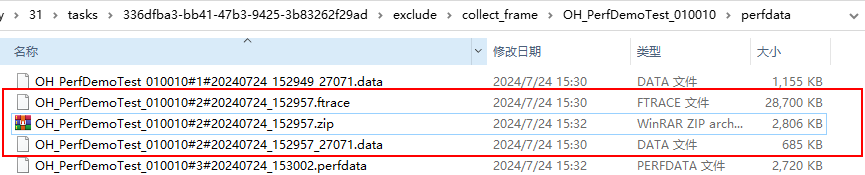

# 如何获取trace文件

更新时间：2026-03-10 06:16:35

来源：https://developer.huawei.com/consumer/cn/doc/harmonyos-faqs/faqs-scenario-based-performance-test-9

 
点击报告中的资源文件“trace”，将自动打开本地文件夹。将对应步骤文件的后缀从“.perfdata”改为“.zip”，然后解压该文件。
