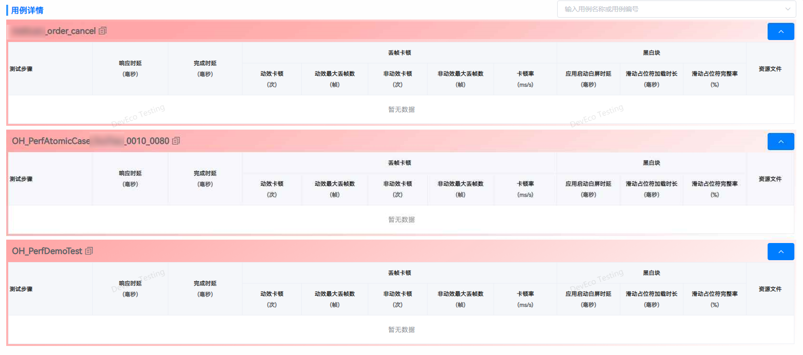

# 测试报告中，用例执行详情为红色，且无数据是什么原因

更新时间：2026-03-10 06:16:35

来源：https://developer.huawei.com/consumer/cn/doc/harmonyos-faqs/faqs-scenario-based-performance-test-13

报告中用例详情表头为红色，表示用例未能成功执行。可以点击报告右上角的执行日志查看具体的错误信息。常见的失败原因包括：用例抛出未捕获的异常、待测应用未安装、设备断开连接等。建议先在PyCharm中运行和调试脚本，确保脚本能够顺利执行，然后再使用DevEco Testing进行正式测试。

