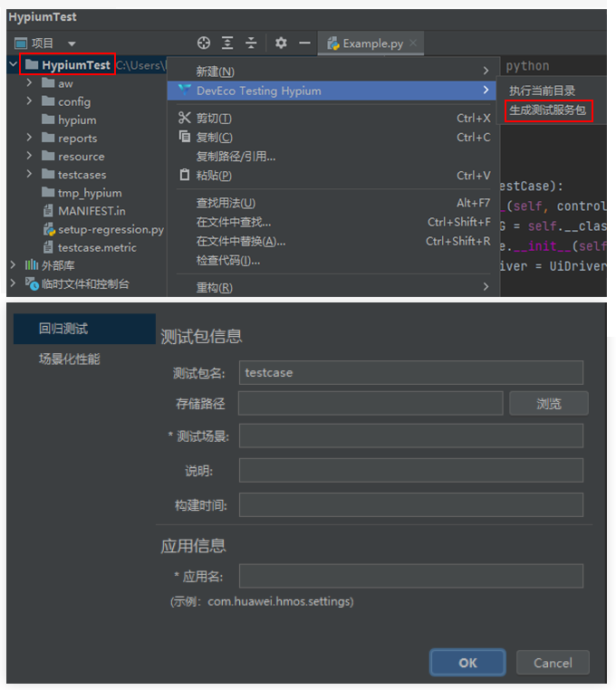

# 创建任务后报错提示“测试套类型异常，请使用回归测试插件生成测试套！”

更新时间：2026-03-10 06:16:35

来源：https://developer.huawei.com/consumer/cn/doc/harmonyos-faqs/faqs-regression-test-14

该场景出现是因为选择的测试包不是由DevEco Testing Hypium插件生成的回归测试服务包，无法用于回归测试。请参照下图重新生成可执行测试包。

