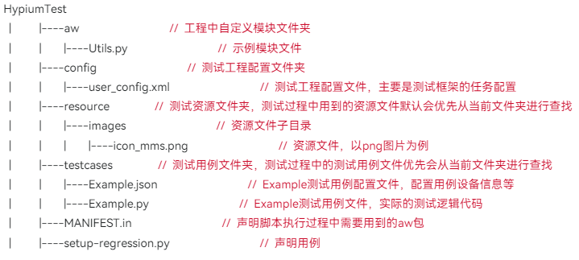

# 生成回归测试包时报错提示“打包失败,当前项目根目录下缺少testcases文件夹”

更新时间：2026-03-10 06:16:35

来源：https://developer.huawei.com/consumer/cn/doc/harmonyos-faqs/faqs-regression-test-1

如果根目录下缺少testcases文件夹，系统将显示相应提示。请根据测试指南中的测试包构建指导构建工程。

一个完整的回归测试工程结构为：

