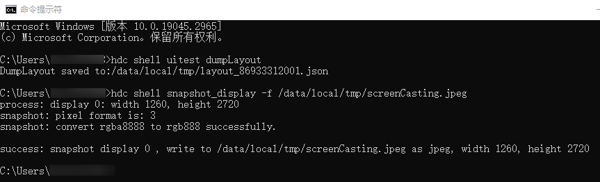

# UIViewer获取页面时，无法展示页面截图和元素树如何处理

更新时间：2026-03-10 06:16:35

来源：https://developer.huawei.com/consumer/cn/doc/harmonyos-faqs/faqs-utilities-uiviewer-2

请排查设备UiTest框架是否正常，打开cmd窗口，在设备上运行 hdc shell uitest dumpLayout 和 hdc shell snapshot_display -f /data/local/tmp/screenCasting.jpeg 两条指令，确认下是否能运行成功，成功运行截图如下：
 

 
如运行失败，请前往DevEco Testing客户端-设置-问题反馈，或通过[华为开发者联盟-在线提单](https://developer.huawei.com/consumer/cn/support/feedback/#/)，提交该场景信息（测试服务名称+异常任务信息+问题描述+问题截图），以便于研发团队进一步分析。
 
注意：客户端提交反馈需打开日志上传开关，华为开发者联盟提单请附上工具日志。
 
Windows日志路径：C:\Users\用户名\AppData\Local\DevEco Testing\common\modules\launcher\logs
 
Mac日志路径：/Users/用户名/Library/Application Support/DevEco Testing/common/modules/launcher/logs
