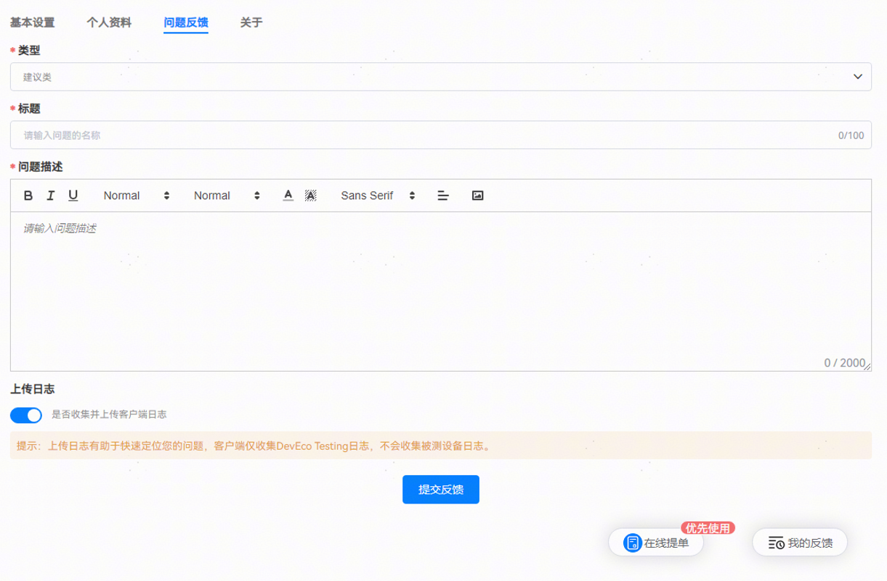

# 测试指南和FAQ无法解决问题时，如何获取在线支持

更新时间：2026-03-10 06:16:35

来源：https://developer.huawei.com/consumer/cn/doc/harmonyos-faqs/faqs-deveco-testing-faq-8

反馈方式1：通过DevEco Testing客户端的“设置”-“问题反馈”功能，提交测试服务名称、异常任务信息、问题描述和问题截图，并开启日志上传开关。

反馈方式2：可通过华为开发者联盟—在线提单，提交测试服务名称+异常任务信息+问题描述+问题截图，并提交工具日志，待研发团队进一步分析后，给出答复。

Windows日志路径：C:\Users\用户名\AppData\Local\DevEco Testing\common\modules\launcher\logs

Mac日志路径：/Users/用户名/Library/Application Support/DevEco Testing/common/modules/launcher/logs
