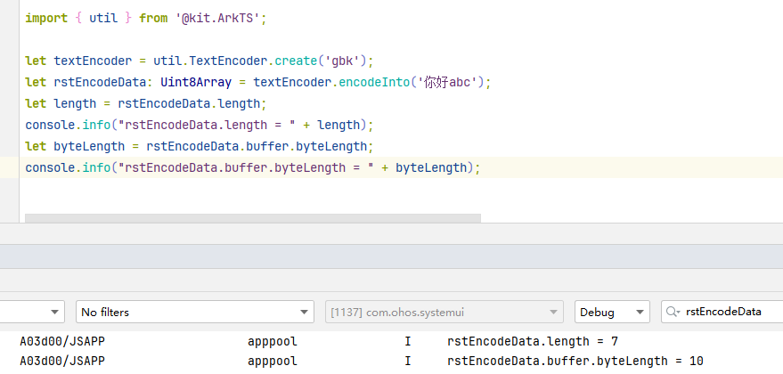

# gbk字符串TextEncoder编码结果属性buffer长度为何比编码结果长度略大

更新时间：2026-03-17 00:56:02

来源：https://developer.huawei.com/consumer/cn/doc/harmonyos-faqs/faqs-arkts-137

问题现象

TextEncoder编码字符串“你好abc”，格式是gbk，分别获取编码结果长度和编码结果属性buffer的长度。如下图显示：

TextEncoder编码结果属性buffer的长度比编码结果的长度略大。





原因解释

在TextEncoder编码底层代码逻辑中，需要创建arraybuffer，通过分析创建的arraybuffer长度就是编码结果buffer属性的长度。

其创建的arraybuffer是用来存放编码结果的，在编码结果生成前时需要提前创建arraybuffer，而创建arraybuffer的长度是未知的，为了保证arraybuffer长度能够存放编码结果，其长度是取编码字符串中单个字符占用的最大字节数乘以字符串长度来设置的，因此导致了TextEncoder编码结果buffer属性的byteLength比编码结果的长度略大。

解决措施

如果需要使用TextEncoder编码结果属性buffer的byteLength准确长度，可以通过buffer自带函数slice，依据TextEncoder编码结果长度获取buffer的byteLength准确长度。示例如下：

```ts
let textEncoder = util.TextEncoder.create('gbk');
let rstEncodeData: Uint8Array = textEncoder.encodeInto('你好abc');
let length = rstEncodeData.length;
console.info('rstEncodeData.length = ' + length);
let byteLength = rstEncodeData.buffer.byteLength;
console.info('rstEncodeData.buffer.byteLength = ' + byteLength);
console.info(
  'rstEncodeData.buffer.slice(0, length).byteLength = ' +
    rstEncodeData.buffer.slice(0, length).byteLength,
);
// rstEncodeData.buffer.slice(0, length).byteLength = 7
```
