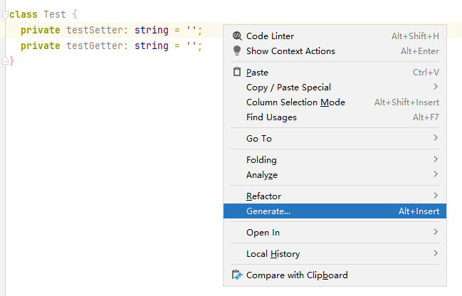
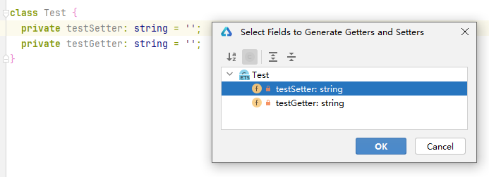

# 如何快速生成class的setter和getter方法

更新时间：2026-03-10 06:16:35

来源：https://developer.huawei.com/consumer/cn/doc/harmonyos-faqs/faqs-arkts-101

1. 在类内部，右键点击，选择“生成”。

2. 选择Getter and Setter。

3. 选择要生成Getters和Setters的字段，点击OK，快速生成。

