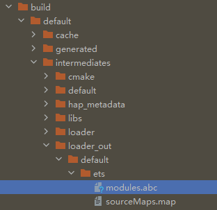

# 编译后生成的.abc文件存放路径在哪里

更新时间：2026-03-17 00:56:02

来源：https://developer.huawei.com/consumer/cn/doc/harmonyos-faqs/faqs-arkts-17

执行编译操作后，abc文件存放路径为：“build/default/intermediates/loader_out/default/ets/modules.abc”。
 

