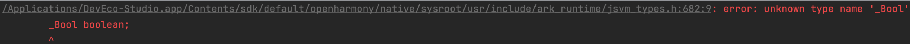

# 如何自排查_Bool类型没有找到的编译问题

更新时间：2026-03-10 06:16:35

来源：https://developer.huawei.com/consumer/cn/doc/harmonyos-faqs/faqs-jsvm-2

问题现象

构建HAP工程时，编译工具报错：“error: unknown type name '_Bool'”，找不到_Bool类型错误，如下所示：

可能原因

JSVM-API基于C99标准的C-API，在C++工程中使用时需注意兼容性。

当前版本SDK提供的C++编译工具链clang++的默认配置为-std=gnu++14。当指定-std=c++xx时，会覆盖默认配置，Clang会使用strict ANSI的编译宏，对应C90标准，不包含GNU C扩展，因此不支持C99标准引入的_Bool。而-std=gnu++xx系列选项会启用GNU C扩展支持，不会产生编译错误。

解决措施

检查构建选项中是否添加了-std=c++xx系列的选项（例如11、14、17等）。

如果存在，那么有以下三种方案可以解决这个问题：

1. 如果使用的C++版本为C++14或更低，可以移除-std=c++xx系列的选项。DevEco Studio提供的编译工具链默认配置为-std=gnu++14。
2. 如果有限定C++版本的需求，建议将 -std=c++xx 修改为 -std=gnu++xx。
3. 在 CMakeLists.txt 中添加选项 -U__STRICT_ANSI__ 也可以解决这个问题。
