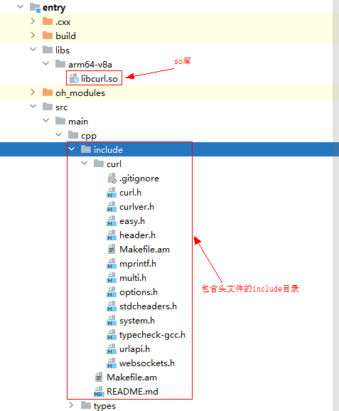

# Native工程中如何使用其他三方so库

更新时间：2026-03-17 00:56:02

来源：https://developer.huawei.com/consumer/cn/doc/harmonyos-faqs/faqs-ndk-34

1.将编译好的so库放到Native工程的entry/libs/arm64-v8a/目录下，并将so库对应的头文件放到entry/src/main/cpp目录层级下（可以在cpp目录下增加一个文件夹专门存放三方so库的头文件）。
 
2.在CMakeLists.txt文件中链入so库。
 
3.在Native侧 .cpp文件中引入头文件使用so库的相关能力。
 
示例如下：
 
在Native侧集成三方库Curl
 
1. 将移植后的Curl的so库放到Native工程的entry/libs/目录下，并将移植后生成的、包含头文件的include目录放到entry/src/main/cpp目录下。
 

 
2. 在CMakeLists.txt文件中链接Curl对应的so库。
 

 
3. 在Native侧.cpp文件中通过引入头文件curl.h来使用Curl的相关能力。
 

 
**参考链接：**
 
[在NDK工程中使用预构建库](https://developer.huawei.com/consumer/cn/doc/harmonyos-guides/build-with-ndk-prebuilts)
