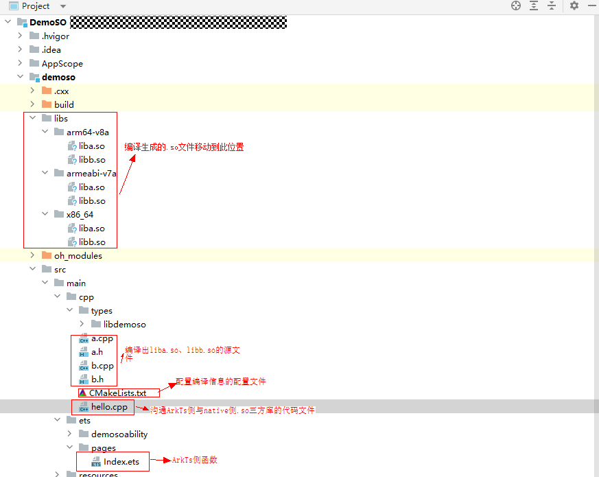

# 多so相互依赖场景下如何解耦

更新时间：2026-03-10 06:16:35

来源：https://developer.huawei.com/consumer/cn/doc/harmonyos-faqs/faqs-ndk-71

**问题现象**
 
A模块包含a.so，B模块包含b.so。a.so调用b.so的函数，b.so也调用a.so的函数。按照正常编译步骤，无论先编译哪个so，都会编译失败。
 
**解决措施**
 
通过dlopen和dlsym接口进行SO编译依赖解耦，将隐式依赖转换为显式依赖。具体示例代码如下：
 1. 修改代码和CMakeLists.txt文件，利用Native侧dlopen方法编译出liba.so和libb.so。生成的.so文件位于build/default/intermediates/cmake/default/obj目录下。（注意一定要用extern "C" {}括起来、不然不能识别到对应的函数导致编译出错）

  
```cpp
// a.cpp
extern "C" {     // Be sure to enclose it with extern 'C' {}
#include "a.h"
#include <dlfcn.h>
#include "stdio.h"
typedef int (*FUNC_SUB)(int, int);
int add(int a, int b) { return a + b; }
int getb(char *path, int a, int b) {       // Path:The sandbox path for passing So files from ArkTS side (note that the path should be passed from ArkTS side, otherwise it may not be found, and the specific code will be listed later)
    void *handle = dlopen(path, RTLD_LAZY);  // Open the dynamic link library with path as path
    if (!handle) {
        return 0;
    }
    FUNC_SUB sub_func = (FUNC_SUB)dlsym(handle, "sub"); // Get the function named sub
    int res = sub_func(a, b);                           // caller function
    dlclose(handle);                                    // Close dynamic link library
    return res;
}
}
```


  
```cpp
// a.h
extern "C" {
#ifndef DemoSO_a_H
#define DemoSO_a_H
int add(int a, int b);
int getb(char *path, int a, int b);
#endif // DemoSO_a_H
}
```


  
```cpp
// b.cpp
extern "C" {     // Be sure to enclose it with extern 'C' {}
#include "b.h"
#include <dlfcn.h>
#include "stdio.h"
typedef int (*FUNC_ADD)(int, int);
int sub(int a, int b) { return a - b; }
int geta(char *path, int a, int b) {    // Path: The sandbox path for passing So files from ArkTS side (note that the path should be passed from ArkTS side, otherwise it may not be found, and the specific code will be listed later)
    void *handle = dlopen(path, RTLD_LAZY);    // Open the dynamic link library with path as path
    if (!handle) {
        return 0;
    }
    FUNC_ADD add_func = (FUNC_ADD)dlsym(handle, "add");      // Get the function named sub
    int res = add_func(a, b);                                // caller function
    dlclose(handle);                                         // Close dynamic link library
    return res;
}
}
```


  
```cpp
// b.h
extern "C" {
#ifndef DemoSO_b_H
#define DemoSO_b_H
int sub(int a, int b);
int geta(char *path, int a, int b);
#endif // DemoSO_b_H
}
```


  
```cpp
# CMakeLists.txt
cmake_minimum_required(VERSION 3.4.1)
project(liba)
# Compile library liba.so
add_library(a SHARED a.cpp)
target_link_libraries(a PUBLIC libace_napi.z.so libhilog_ndk.z.so)
project(libb)
# Compile library libb.so
add_library(b SHARED b.cpp)
target_link_libraries(b PUBLIC libace_napi.z.so libhilog_ndk.z.so)
```

2. 将生成的.so文件（相对路径：build/default/intermediates/cmake/default/obj）移动到libs目录。移动完成后，目录结构如下：

  


3. 修改CMakeLists.txt文件，将编译生成的.so文件引入到工程中。
```cpp
# CMakeLists.txt
cmake_minimum_required(VERSION 3.4.1)
project(DemoSO)
set(NATIVERENDER_ROOT_PATH ${CMAKE_CURRENT_SOURCE_DIR})
include_directories(${NATIVERENDER_ROOT_PATH}
                    ${NATIVERENDER_ROOT_PATH}/include)
# Add libdemoso. so file
add_library(demoso SHARED hello.cpp)
# Add dependency libraries liba.so and libb.so. Please note to include the path, otherwise the corresponding SO library cannot be found
target_link_libraries(demoso PUBLIC libace_napi.z.so ${CMAKE_CURRENT_SOURCE_DIR}/../../../libs/${OHOS_ARCH}/liba.so ${CMAKE_CURRENT_SOURCE_DIR}/../../../libs/${OHOS_ARCH}/libb.so)
```


  
```ArkTS
// index.ets
import testNapi from 'libdemoso.so';
import { hilog } from '@kit.PerformanceAnalysisKit';

@Entry
@Component
struct Index {
  @State message: string = 'Hello World';
  private path: string = '';

  build() {
    Row() {
      Column() {
        Text(this.message)
          .fontSize(50)
          .fontWeight(FontWeight.Bold)
          .onClick(() => {
            this.path = this.getUIContext().getHostContext()!.bundleCodeDir;   // get path
            hilog.info(0x0000, 'testTag', 'Test NAPI 5 + 3 = %{public}d', testNapi.add(5, 3, this.path + '/libs/arm64/liba.so'));  // Call the native side function
            hilog.info(0x0000, 'testTag', 'Test NAPI 5 - 3 = %{public}d', testNapi.sub(5, 3, this.path + '/libs/arm64/libb.so'));
          })
      }
      .width('100%')
    }
    .height('100%')
  }
}
```


  
```ts
// index.d.ts
export const add: (a: number, b: number, path: string) => number;
export const sub: (a: number, b: number, path: string) => number;
```


  
```cpp
// hello.cpp
#include "a.h"
#include "b.h"
#include "napi/native_api.h"

static napi_value Add(napi_env env, napi_callback_info info) {
    size_t requireArgc = 3;
    size_t argc = 3;
    napi_value args[3] = {nullptr};
    napi_get_cb_info(env, info, &argc, args, nullptr, nullptr);
    napi_valuetype valuetype0;
    napi_typeof(env, args[0], &valuetype0);
    napi_valuetype valuetype1;
    napi_typeof(env, args[1], &valuetype1);
    napi_valuetype valuetype2;
    napi_typeof(env, args[2], &valuetype2);
    int value0;
    napi_get_value_int32(env, args[0], &value0);
    int value1;
    napi_get_value_int32(env, args[1], &value1);
    char path[255];
    size_t size = 255;
    napi_get_value_string_utf8(env, args[2], path, 255, &size);
    int res = geta(path, value0, value1);                    // Call the function and pass the sandbox path
    napi_value sum;
    napi_create_int32(env, res, &sum);
    return sum;
}
static napi_value Sub(napi_env env, napi_callback_info info) {
    size_t requireArgc = 3;
    size_t argc = 3;
    napi_value args[3] = {nullptr};
    napi_get_cb_info(env, info, &argc, args, nullptr, nullptr);
    napi_valuetype valuetype0;
    napi_typeof(env, args[0], &valuetype0);
    napi_valuetype valuetype1;
    napi_typeof(env, args[1], &valuetype1);
    napi_valuetype valuetype2;
    napi_typeof(env, args[2], &valuetype2);
    int value0;
    napi_get_value_int32(env, args[0], &value0);
    int value1;
    napi_get_value_int32(env, args[1], &value1);
    char path[255];
    size_t size = 255;
    napi_get_value_string_utf8(env, args[2], path, 255, &size);
    int res = getb(path, value0, value1);                 // Call the function and pass the sandbox path
    napi_value sum;
    napi_create_int32(env, res, &sum);
    return sum;
}
EXTERN_C_START
static napi_value Init(napi_env env, napi_value exports) {
    napi_property_descriptor desc[] = {{"add", nullptr, Add, nullptr, nullptr, nullptr, napi_default, nullptr},
                                       {"sub", nullptr, Sub, nullptr, nullptr, nullptr, napi_default, nullptr}};
    napi_define_properties(env, exports, sizeof(desc) / sizeof(desc[0]), desc);
    return exports;
}
EXTERN_C_END

static napi_module demoModule = {
    .nm_version = 1,
    .nm_flags = 0,
    .nm_filename = nullptr,
    .nm_register_func = Init,
    .nm_modname = "demoso",
    .nm_priv = ((void *)0),
    .reserved = {0},
};
extern "C" __attribute__((constructor)) void RegisterDemosoModule(void) { napi_module_register(&demoModule); }
```
