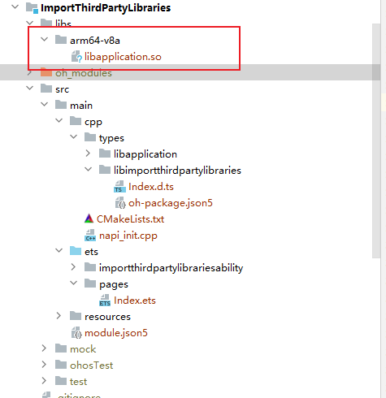
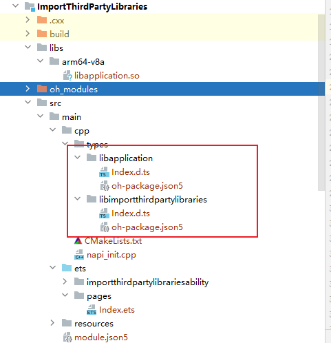

# 如何在ArkTS侧引用其他三方so库

更新时间：2026-03-10 06:16:35

来源：https://developer.huawei.com/consumer/cn/doc/harmonyos-faqs/faqs-ndk-21

解决措施

在ArkTS中引用三方库so需要具备以下三个文件：xxx.so、Index.d.ts和oh-package.json5。其中，Index.d.ts和oh-package.json5在C++模板中自带，也可以手动创建。在需要调用的模块根目录下的oh-package.json5中声明so库的根目录路径。然后在代码中使用import语句引用oh-package.json5中声明的依赖名称。此方案仅适用于已经适配了Native的so库。因此，在编译生成so库时，需要实现功能函数并注册其Native侧接口，同时提供对应的Native侧接口声明文件Index.d.ts和配置文件oh-package.json5。

1. 将so文件移动到libs文件夹下对应架构的目录。如果在纯ArkTS工程中，还需将编译三方库时生成的libc++\_xxx.so移动到该目录。

2. 在src/main/cpp/types目录下创建新目录，并将Index.d.ts和oh-package.json5文件移动到该目录下。

3. 在模块级的oh-package.json5文件中声明该 so 库的根目录路径。
```json
"dependencies": {
"libimportthirdpartylibraries.so": "file:./src/main/cpp/types/libimportthirdpartylibraries",
"libapplication.so": "file:./src/main/cpp/types/libapplication"
},
```
4. 在代码中引用并调用oh-package.json5中声明的依赖。
```ts
import testNapi from 'libimportthirdpartylibraries.so';
import myNapi from 'libapplication.so';

@Entry
@Component
struct Index {
@State message: string = 'Hello World';

build() {
Row() {
Column() {
Text(this.message)
.fontSize(50)
.fontWeight(FontWeight.Bold)
.onClick(() => {
console.info(`MyTest NAPI 2 + 3 = ${myNapi.add(2, 3)}`);
console.info(`MyTest NAPI 2 - 3 = ${testNapi.sub(2, 3)}`);
})
}
.width('100%')
}
.height('100%')
}
}
```


运行结果：


参考链接

在ArkTS侧引用三方so库
