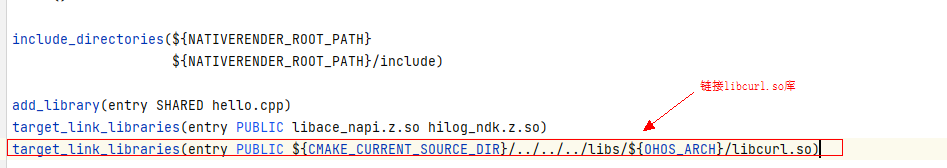
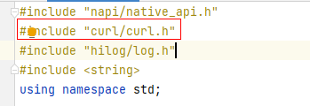
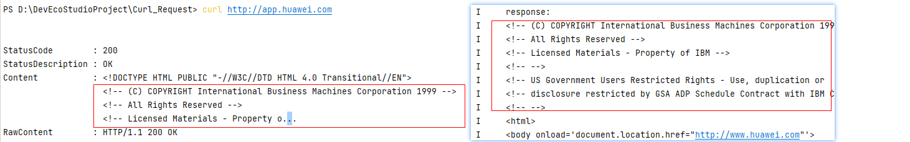

# 如何在Native侧集成三方库Curl，并进行HTTP数据请求

更新时间：2026-03-10 06:16:35

来源：https://developer.huawei.com/consumer/cn/doc/harmonyos-faqs/faqs-ndk-31

可以将Curl移植到HarmonyOS，并在Native侧开发时直接使用Curl的C++库实现。具体的移植方法请参考相关链接。

具体使用步骤如下：

1. 将移植后的Curl的so库放入Native工程的entry/libs/arm64-v8a/目录，将包含头文件的include目录放入entry/src/main/cpp目录。

2. 在CMakeLists.txt文件中链接Curl对应的so库。

3. 在Native侧的.cpp文件中引入头文件curl.h，使用Curl的相关能力。

 具体可参考以下代码：
```cpp
#include "curl/curl.h"

// ...

// Get request and post request data response functions
size_t ReqReply(void *ptr, size_t size, size_t nmemb, void *userdata) {
string *str = reinterpret_cast<string *>(userdata);
(*str).append((char *)ptr, size * nmemb);
return size * nmemb;
}

// http GET Request configuration
CURLcode CurlGetReq(const std::string &url, std::string &response) {
// Curl initialization
CURL *curl = curl_easy_init();
// Curl return value
CURLcode res;
if (curl) {
// Set the request header for Curl
struct curl_slist *headers = NULL;
headers = curl_slist_append(headers, "Content-Type:application/json");
curl_easy_setopt(curl, CURLOPT_HTTPHEADER, headers);

// Set the URL address for the request
curl_easy_setopt(curl, CURLOPT_URL, url.c_str());

// Receive response header data, 0 represents not receiving, 1 represents receiving
curl_easy_setopt(curl, CURLOPT_HEADER, 1);

// Set data receiving function
curl_easy_setopt(curl, CURLOPT_WRITEFUNCTION, ReqReply);
curl_easy_setopt(curl, CURLOPT_WRITEDATA, (void *)&response);

// Set to not use any signal/alarm handlers
curl_easy_setopt(curl, CURLOPT_NOSIGNAL, 1);

// Set timeout period
curl_easy_setopt(curl, CURLOPT_CONNECTTIMEOUT, 10);
curl_easy_setopt(curl, CURLOPT_TIMEOUT, 10);

// Open request
res = curl_easy_perform(curl);
}
// Release curl
curl_easy_cleanup(curl);
return res;
}


static napi_value NatReq(napi_env env, napi_callback_info info) {
string getUrlStr = "http://app.huawei.com";
string getResponseStr;
auto res = CurlGetReq(getUrlStr, getResponseStr);
if (res == CURLE_OK) {
OH_LOG_Print(LOG_APP, LOG_INFO, 0xFF00, "pure", "response: \n%{public}s", getResponseStr.c_str());
}

// ...
}
```


结果展示

终端使用curl指令获取的网站信息一致。





参考链接

使用命令行CMake构建NDK工程

使用lycium工具快速编译三方库
