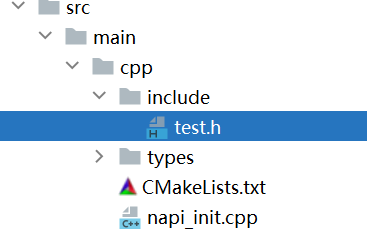
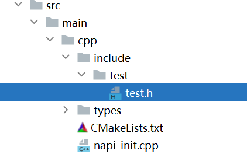

# 如何正确地在CMakeLists.txt文件中配置头文件搜索路径

更新时间：2026-03-12 12:31:01

来源：https://developer.huawei.com/consumer/cn/doc/harmonyos-faqs/faqs-ndk-43

请按照以下示例进行配置：
 
**例1****：**
 
目录结构：
 

 
CMakeLists.txt配置头文件搜索路径：
 
include_directories(${NATIVERENDER_ROOT_PATH}/include)
 
cpp文件中引用头文件:
 
#include 'test.h'
 
**例2****：**
 
目录结构：
 

 
CMakeLists.txt配置头文件搜索路径：
 
include_directories(${NATIVERENDER_ROOT_PATH})
 
cpp文件中引用头文件:
 
#include 'include/test/test.h'
 
**例3：**
 
目录结构：
 

 
CMakeLists.txt配置头文件搜索路径：
 
include_directories(${NATIVERENDER_ROOT_PATH}/include)
 
cpp文件中引用头文件:
 
#include 'test/test.h'
 
**例4:**
 
目录结构：
 

 
CMakeLists.txt配置头文件搜索路径:
 
include_directories(${NATIVERENDER_ROOT_PATH}/include/test)
 
cpp文件中引用头文件:
 
#include 'test.h'
