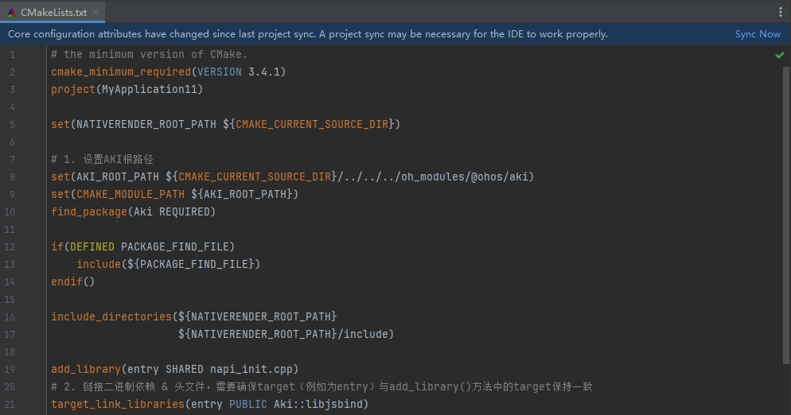

# 如何通过AKI三方库实现ArkTS与C/C++之间的跨语言调用

更新时间：2026-03-10 06:16:35

来源：https://developer.huawei.com/consumer/cn/doc/harmonyos-faqs/faqs-ndk-33

ArkTS与C/C++之间交互，涉及到跨语言调用中数据转换，以及跨线程交互等内容。沿用Node-API标准实现，支持的Node-API接口可参见Node-API支持的数据类型和接口。

当前可以通过AKI三方库实现跨语言调用。AKI针对OpenHarmony上提供ArkTS与C/C++跨语言互调的场景提供解决方案，提供了极简语法糖使用方式，一行代码完成ArkTS与C/C++的无障碍跨语言互调，所见即所得。同时开发者无需关心Node-API的线程安全问题、Native对象GC问题，为开发者屏蔽Node-API内部复杂逻辑。

1. OHPM HAR包依赖：在指定路径下（例如：项目根路径/entry），输入以下命令安装ohpm har包依赖。
```bash
cd entry
ohpm install @ohos/aki
```
 在CMakeLists.txt中添加依赖，假设编译的动态库名为libhello.so。
```text
# ...

# 1. Set the AKI root path
set(AKI_ROOT_PATH ${CMAKE_CURRENT_SOURCE_DIR}/../../../oh_modules/@ohos/aki)
set(CMAKE_MODULE_PATH ${AKI_ROOT_PATH})
find_package(Aki REQUIRED)

# ...

add_library(entry SHARED napi_init.cpp)
# 2. To link the binary dependencies & header file, you need to make sure that the target (e.g. entry) is the same as the target in the add_library() method
target_link_libraries(entry PUBLIC Aki::libjsbind)
```
 在右上角同步工程。

2. 在napi_init.cpp文件中定义业务，并将业务接口导出给 ArkTS。
```cpp
#include <aki/jsbind.h>
#include <string>
// 1、User defined business
std::string SayHello(std::string msg){  return msg + " too.";}

// 2、Export business interface
// Step 1: Register the AKI plugin
JSBIND_ADDON(entry) // Register AKI plugin name: This is the compiled *. so name, following the same rules as Node API

// Step 2: Register FFI Features
JSBIND_GLOBAL()
{
JSBIND_FUNCTION(SayHello);
}
```


注册的AKI插件名需与模块级 oh-package.json5 文件中 dependencies 标签下的 “lib<AKI插件名>” 字段名称一致。例如，libentry.so。

1. 在“src/main/cpp/types/libentry/index.d.ts”中导出 .so 文件的接口。export const SayHello: (msg: string) => string;
2. 在ArkTS文件中调用.so文件中的接口。
```ts
import aki from 'libentry.so' // *. so compiled from the project

@Entry
@Component
struct Index {
@State message: string = 'Hello World';

build() {
Row() {
Column() {
Text(this.message)
.fontSize(50)
.fontWeight(FontWeight.Bold)
.onClick(() => {
console.info(aki.SayHello("hello world")); // 调用.so文件中的代码接口
})
}
.width('100%')
}
.height('100%')
}
}
```


参考链接

AKI 项目介绍
