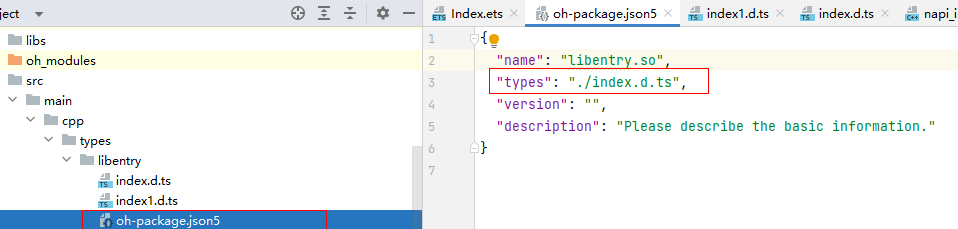

# 如何通过多个xxx.d.ts文件导出Native侧接口

更新时间：2026-03-17 00:56:02

来源：https://developer.huawei.com/consumer/cn/doc/harmonyos-faqs/faqs-ndk-63

**问题现象**
 
由于底层C++库规模较大，向外暴露的接口数量较多，建议将其拆分成多个.d.ts文件以便归类。
 
**解决措施**
 
在oh-package.json5中的types字段只能指定一个出口。如果需要封装多个.d.ts文件中的接口，可以使用重导出的方式。
 



 
实现方式：
 
在index1.d.ts文件中声明Native侧导出接口，然后通过index.d.ts文件重导出到ArkTS侧使用。
 
在index1.d.ts文件中导出接口。
 
```ts
export const sub: (a: number, b: number) => number;
```
 
在index.d.ts文件中重导出这些接口。
 
```ts
export {sub} from './index1'
export const add: (a: number, b: number) => number;
```
