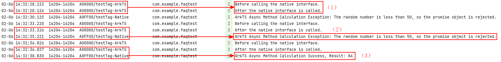

# 如何在Native侧调用ArkTS侧异步方法，并获取异步计算结果到Native侧

更新时间：2026-03-10 06:16:35

来源：https://developer.huawei.com/consumer/cn/doc/harmonyos-faqs/faqs-ndk-32

该场景可以通过在Native侧获取ArkTS侧的Promise对象来实现。具体步骤如下：

- ArkTS侧实现：调用Native接口时，传入callback回调；在回调中构造Promise对象。
- 在Promise构造函数的参数回调中，实现异步操作，并根据操作结果调用resolve或reject接口，以进行Promise对象的状态迁移。
- Native侧实现：定义Promise对象的then属性回调方法，用于处理ArkTS中的异步计算结果。
- 定义Promise对象的catch方法，用于处理ArkTS异步计算中的异常。
- 在Native接口实现中，使用napi_call_function接口执行ArkTS侧传入的callback回调，获取Promise对象。
- 通过napi_get_named_property接口获取 Promise 对象的then和catch属性。
- 通过napi_create_function接口将上述定义的then和catch属性的 C++ 回调方法转换为 ArkTS 函数对象。
- 通过napi_call_function接口执行then和catch属性对应的 ArkTS 函数对象，处理异步计算结果和异常信息。类似于在 ArkTS 侧调用“promise.then(() => {})和promise.catch(() => {})”。


具体可参考以下示例代码：

（一）ArkTS侧实现

```ts
// ...
import testNapi from 'libentry.so';

@Entry
@Component
struct Index {
build() {
Row() {
Column() {
Text('testPromise')
// ...
.onClick(() => {
hilog.info(0x0000, 'testTag-ArkTS', 'Before calling the native interface.');
// Call the Native interface and return the call information
testNapi.testPromise(() => {
// Callback is used to create ArkTS side Promise objects
return new Promise((resolve: Function, reject: Function) => {
// Simulate ArkTS side asynchronous method through setTimeout interface
// Scenario: After 2 seconds, trigger the setTimeout timer callback to generate a random number randomNumber. By judging the size of the random number, it is used to trigger different states of the promise object, and then perform different callback processing
setTimeout(()=>{
const randomNumber: number = 100 * Math.random();
if (randomNumber > 50) {
// If randomNumber is greater than 50, call the resolve method to transition the state of the Promise object to the fulfilled state, and pass the random number to the Native side as a callback parameter for the then method
resolve(randomNumber);
} else {
// If randomNumber is less than/equal to 50, call the reject method to transfer the state of the Promise object to the rejected state, and pass the exception information to the Native side as the callback parameter of the catch method
reject('The random number is less than 50, so the promise object is rejected.')
}
}, 2000);
})
}
)
hilog.info(0x0000, 'testTag-ArkTS', 'After the native interface is called.');
})
}
.width('100%')
}
.height('100%')
}
}
```

（二）Native侧实现

```cpp
#include "napi/native_api.h"
#include "hilog/log.h"

// Define callback methods for the then property of Promise objects
// The callback method of the then attribute can have no return value
// In the following text, it is necessary to create an ArkTS function object through napi_make_function, so set the return value to napi_value and return nullptr at the end of the function
napi_value ThenCallBack(napi_env env, napi_callback_info info) {
size_t argc = 1;
napi_value args[1] = {nullptr};
napi_get_cb_info(env, info, &argc, args, nullptr, nullptr);
int32_t asyncResult = 0; // ArkTS side asynchronous method calculation results
napi_get_value_int32(env, args[0], &asyncResult);
OH_LOG_Print(LOG_APP, LOG_INFO, 0xFF00, "testTag-Native", "ArkTS Async Method Calculation Success, Result: %{public}d",
asyncResult);
return nullptr;
}
// Define callback methods for catch properties of Promise objects
// The callback method of the catch property can have no return value
// In the following text, it is necessary to create an ArkTS function object through napi_make_function, so set the return value to napi_value and return nullptr at the end of the function
napi_value CatchCallBack(napi_env env, napi_callback_info info) {
size_t argc = 1;
napi_value args[1] = {nullptr};
napi_get_cb_info(env, info, &argc, args, nullptr, nullptr);
size_t strLen = 0;
napi_get_value_string_utf8(env, args[0], nullptr, 0, &strLen); // Get string length to strLen
char *strBuffer = new char[strLen + 1]; // Allocate a char array of appropriate size
napi_get_value_string_utf8(env, args[0], strBuffer, strLen + 1, &strLen); // Get a string representing the information about the abnormal calculation of the ArkTS side asynchronous method
OH_LOG_Print(LOG_APP, LOG_INFO, 0xFF00, "testTag-Native",
"ArkTS Async Method Calculation Exception: %{public}s", strBuffer);
return nullptr;
}
static napi_value TestPromise(napi_env env, napi_callback_info info) {
size_t argc = 1;
napi_value args[1] = {nullptr};
napi_get_cb_info(env, info, &argc, args, nullptr, nullptr); // Analyze the callback passed by ArkTS side

napi_value arktsPromise = nullptr;
// Execute callback through napi_call_function to return the promise object created by ArkTS side
napi_call_function(env, nullptr, args[0], 0, nullptr, &arktsPromise);

// Get the then property of the promise object, whose callback method is used to handle the asynchronous calculation results on the ArkTS side
napi_value thenProperty = nullptr;
napi_get_named_property(env, arktsPromise, "then", &thenProperty);
// Convert the then property callback method defined in the C++language into an ArkTS function object, which is a napi_value type value
napi_value thenCallback = nullptr;
napi_create_function(env, "thenCallback", NAPI_AUTO_LENGTH, ThenCallBack, nullptr, &thenCallback);

// Get the catch property of the promise object, whose callback method is used to handle information about ArkTS side asynchronous computation exceptions
napi_value catchProperty = nullptr;
napi_get_named_property(env, arktsPromise, "catch", &catchProperty);
// Convert the catch property callback method defined in the C++language into an ArkTS function object, i.e. a napi_value type value
napi_value catchCallback = nullptr;
napi_create_function(env, "catchCallback", NAPI_AUTO_LENGTH, CatchCallBack, nullptr, &catchCallback);

// Execute the callback of the then attribute through napi_call_function, similar to calling promise. then()=>{} on the ArkTS side
napi_call_function(env, arktsPromise, thenProperty, 1, &thenCallback, nullptr);
// Execute a callback for the catch property through napi_call_function, similar to calling promise. catch (()=>{}) on the ArkTS side
napi_call_function(env, arktsPromise, catchProperty, 1, &catchCallback, nullptr);
return nullptr;
}
```

运行结果





- 结果（1）：表示ArkTS侧调用Native接口后，Native侧运行未阻塞，直接返回。
- 结果（2）：表示ArkTS侧调用Native接口后，等待2秒（异步计算）。如果异步操作中生成的随机数小于或等于50，通过Promise对象的reject接口传入异常信息到Native侧，并通过catch回调进行处理。
- 结果（3）：表示ArkTS侧调用Native接口后，等待2秒（异步计算）。如果异步操作中生成的随机数大于50，则通过Promise对象的resolve接口将该随机数传入Native侧，并通过then回调进行处理和显示。
