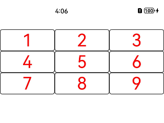

# List组件如何实现多列效果

更新时间：2026-03-10 06:16:35

来源：https://developer.huawei.com/consumer/cn/doc/harmonyos-faqs/faqs-arkui-27

设置List组件的lanes属性，以实现交叉轴上的多列布局。示例代码如下：

```ts
// xxx.ets
@Entry
@Component
struct ListExample {
@State arr: string[] = ['1', '2', '3', '4', '5', '6', '7', '8', '9'];

build() {
Column() {
List() {
ForEach(this.arr, (item: string) => {
ListItem() {
Row() {
Text(item)
.fontColor(Color.Red)
.fontSize(40)
}
}
.width('100%')
.border({
width: 1,
color: Color.Black,
radius: 5
})
})
}
.lanes(3)
.alignListItem(ListItemAlign.Center)
}
.padding({ top: 30 })
}
}
```

效果如图所示：



