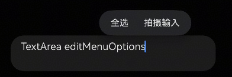
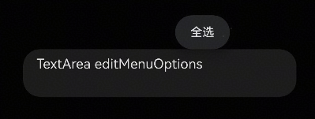

# TextInput、TextArea等组件如何禁止提示拍摄输入

更新时间：2026-03-25 01:58:01

来源：https://developer.huawei.com/consumer/cn/doc/harmonyos-faqs/faqs-arkui-450

问题描述

在使用TextInput、TextArea等文本输入类组件时，系统会默认生成编辑选项，如拍照输入、全选等气泡内容，如果希望隐藏该内容，如何实现？





解决措施

方案一：禁用editMenuOptions的菜单选项。

1. 以禁止为例，定义onCreateMenu方法，使用filter函数切除Array中的粘贴选项。
2. 在editMenuOptions属性中使用onCreateMenu方法初始化editMenu。


示例代码如下：

```ts
@Entry
@Component
struct TextAreaExample {
@State text: string = 'TextArea editMenuOptions';

onCreateMenu(menuItems: Array<TextMenuItem>) {
menuItems = menuItems.filter((item) => item.content !== 'Photo Input'); // Can also choose to disable other menu options such as "Aelect All".
return menuItems;
}

build() {
Column() {
TextArea({ text: this.text })
.width('95%')
.height(56)
.editMenuOptions({
onCreateMenu: this.onCreateMenu,
onMenuItemClick: (menuItem: TextMenuItem, textRange: TextRange) => {
return false; // Return false, execute custom logic first, then execute system logic
}
})
.margin({ top: 100 })
}
.width('90%')
.margin('5%')
}
}
```

实现效果：





方案二：如果想隐藏该组件上所有的弹出气泡，包括复制、粘贴、全选、拍摄输入等，可以利用selectionMenuHidden属性隐藏系统文本选择菜单，示例代码如下：

```ts
@Entry
@Component
struct Index {
@State message: string = '';

build() {
Column() {
Text(`The input content：${this.message}`)
.margin({
top: 100,
bottom: 30
})
TextInput({ placeholder: 'Please enter the content' })
.borderRadius(0)
.onChange((value: string) => {
this.message = value;
})
.selectionMenuHidden(true)
}
.width('100%')
.height('100%')
}
}
```

方案三：对于需要菜单都自定义实现的，可以拦截整个默认菜单并使用自定义bindContextMenu代替。可以参考：长按弹出菜单的自定义预览样式。

参考链接

文本拓展自定义菜单

editMenuOptions
